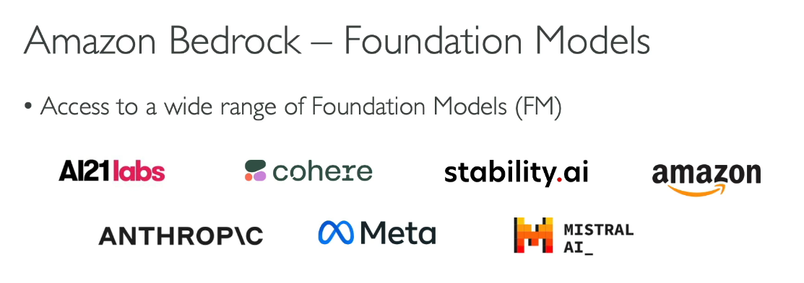
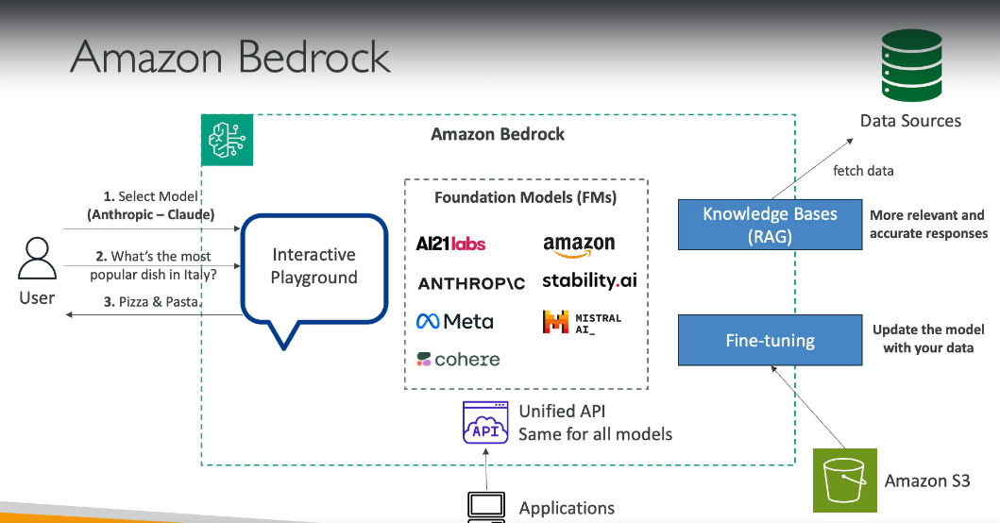

# Amazon Bedrock Overview

Amazon Bedrock is a fully managed service designed to help you build generative AI applications with ease. Here's a summary of its features and benefits:

## Key Features

- **Generative AI Applications**: Build applications that generate text, images, and more using advanced AI models.
- **Fully Managed Service**: No servers to manage—Amazon Bedrock handles infrastructure for you.
- **Control Your Data**: Your data remains within your account; none of it is sent to model providers.
- **Pay-Per-Use Model**: Only pay for what you use, without upfront costs.
- **Unified API**: Access various foundational models through a single API.

## Foundational Models

Amazon Bedrock offers access to several foundational models, including:

- **Meta**
- **Amazon**
- **AI21 Labs**
- **Anthropic**
- **Stability.ai**

These models can be customized to fit your needs. Amazon Bedrock allows you to create your own copy of a foundational model and fine-tune it with your own data.

**Note**: All activities occur solely within your account, ensuring that none of your data is sent to external providers.

# Amazon Bedrock

Amazon Bedrock is a service that allows you to build Generative AI (Gen-AI) applications on AWS. It is a fully-managed service, so you don't have to manage servers yourself. You maintain control of your data used to train the model, and it operates on a pay-per-use pricing model. Amazon Bedrock offers unified APIs and leverages a wide array of foundational models with out-of-the-box features such as RAG and LLM Agents. It also includes features for Security, Privacy, Governance, and Responsible AI.

## Foundation Models

- **Access to a Wide Range of Foundation Models (FM):** Amazon Bedrock makes a copy of the FM available only to you, which you can further fine-tune with your own data.
- **Data Privacy:** None of your data is used to train the FM.

## Amazon Bedrock – Foundation Models

a pre-trained model that provides a base upon which you can build and customize your AI applications. These models are trained on vast amounts of diverse data and are designed to perform a wide range of general tasks. Here’s a more detailed explanation:

- **Interactive Playground:** Allows you to select models and interact with them.
  1. **Select Model** (e.g., Anthropic – Claude)
  2. **Ask Questions** (e.g., “What’s the most popular dish in Italy?”)
  3. **Receive Answers** (e.g., “Pizza & Pasta.”)
- **Knowledge Bases (RAG):** Fetch data from various sources to provide more relevant and accurate responses.
- **Fine-Tuning:** Update the model with your data using Amazon S3.
- **Unified API:** Same API for all models.

## Choosing Foundation Models

When selecting a foundation model, consider:
- **Model Types:** Performance requirements, capabilities, constraints, and compliance.
- **Customization:** Level of customization, model size, inference options, licensing agreements, context windows, and latency.
- **Multimodal Models:** Models that handle varied types of input and output.
- **Amazon Titan:** High-performing foundation models from AWS, offering image, text, and multimodal model choices via fully-managed APIs. Smaller models may be more cost-effective.

## Example Models Comparison

| Model               | Max. Tokens   | Features                                               | Use Cases                                    | Pricing (1K Tokens)                |
|---------------------|---------------|--------------------------------------------------------|----------------------------------------------|-----------------------------------|
| **Amazon Titan**    | 8K Tokens     | High-performance text model, +100 languages           | Content creation, classification, education  | Input: $0.0008, Output: $0.0016   |
| **Llama**           | 4K Tokens     | Large-scale tasks, dialogue, English                   | Text generation, customer service            | Input: $0.0019, Output: $0.0025   |
| **Claude**          | 200K Tokens   | High-capacity text generation, multi-language          | Analysis, forecasting, document comparison   | Input: $0.008, Output: $0.024    |
| **Stable Diffusion**| 77-Tokens/Prompt | Image generation                                       | Image creation for advertising, media        | $0.04 – 0.08 / image              |

## Fine-Tuning a Model

- **Adaptation:** Fine-tune a copy of a foundation model with your own data. Fine-tuning alters the weights of the base model.
- **Training Data Requirements:** Must adhere to a specific format and be stored in Amazon S3.
- **Types:** Either Fine-Tuning (one time) or Continued Pre-Training (continuous).
- **Provisioned Throughput:** Required to use a fine-tuned model. Note that not all models can be fine-tuned.

## Fine-Tuning – Use Cases

- **Chatbots:** Tailor to a specific persona or tone.
- **Up-to-Date Information:** Incorporate more recent data.
- **Exclusive Data:** Use proprietary information like historical emails.
- **Targeted Use Cases:** Enhance categorization or accuracy assessments.

## Evaluating a Model

### Automatic Evaluation

- **Built-in Task Types:** Includes text summarization, question and answer, text classification, and open-ended text generation.
- **Datasets:** Use built-in or custom prompt datasets.
- **Scoring:** Automatic calculation using various statistical methods (e.g., BERTScore, F1).

### Human Evaluation

- **Evaluation Team:** Choose internal employees or subject-matter experts.
- **Metrics:** Define how to evaluate (e.g., thumbs up/down, ranking).
- **Task Types:** Same as Automatic or custom tasks.

## Business Metrics to Evaluate a Model

- **User Satisfaction:** Assess user feedback and satisfaction with model responses.
- **Average Revenue Per User (ARPU):** Measure revenue attributed to the Gen-AI app.
- **Cross-Domain Performance:** Evaluate the model’s ability to handle tasks across different domains.
- **Conversion Rate:** Monitor desired outcomes such as purchases.
- **Efficiency:** Evaluate the model’s computational efficiency and resource utilization.
