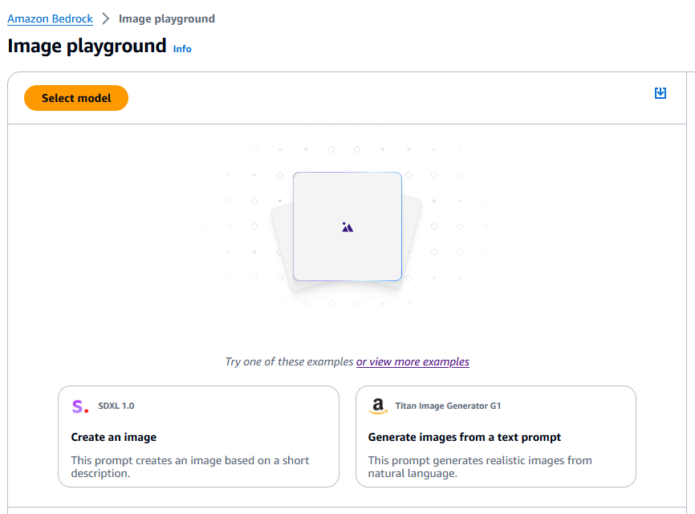

# AWS Bedrock Tutorial

## Open Your Account and Use US East-1 Region

1. **Search for Amazon Bedrock Services**

   

2. **Explore the List of Providers:**

   

   You can read additional information about the models.

3. **Select Model Access:**

   

4. **Click Enable All Models:**

   Select a "Use case"

   

   Enabling the models does not cost money. Using the models will cost money.

   

   There may be some models that are inaccessible or slow to load.

   

5. **Choose Examples in the Left-Hand Side Menu:**

   

   You may filter by provider and by prompt.

6. **Select a Model:**

   In this instance, we will use Titan G1-Express.

   

7. **Test a Particular Prompt:**

   

8. **Try with a Chat Model This Time:**

   

   This time we will use the Anthropic "Claude 3 Sonnet" model.

   

   We will be provided with model metrics as well, including:
   - Latency
   - Amount of text
   - Input words
   - Output words

   

9. **We Have the Option to Apply Images as Well:**

   However, this will cost significantly more money.

   

   Type a description and an image will appear.

   

# How to Choose a Model in Amazon Bedrock

## Understanding Model Types and Capabilities

When selecting a model in Amazon Bedrock, consider the following factors:

1. **Model Types**
   - **Multimodal Models**: Handle varied inputs and outputs, such as images and text.
   - **Amazon Titan**: A high-performing foundational model provided directly by AWS. It supports both image and text processing through a fully managed API and can be customized.

   

2. **Performance, Capabilities, and Constraints**
   - **Amazon Titan**: Known for high performance and flexibility with text and image data.
   - **Claude**: Offers the highest token limit (200K), supports more input data but has higher output costs.
   - **Stable Diffusion**: Limited to 77 tokens and is primarily used for image generation. It tends to be more expensive.

3. **Pricing Comparison**
   - **Amazon Titan**: Generally more cost-effective compared to other models.
   - **Claude and Lambda**: Higher token limits come with increased costs.
   - **Stable Diffusion**: More expensive, mainly due to its focus on image generation.

  # Model Pricing Comparison Chart

| Model              | Max Tokens | Features                           | Use Cases                   | Pricing          |
|--------------------|------------|------------------------------------|-----------------------------|------------------|
| **Amazon Titan**   | Up to 100K  | Text and image processing, customizable | Versatile tasks, custom applications | Cost-effective   |
| **Claude**         | 200K       | High token limit, text processing  | Large input data, complex queries | Higher cost      |
| **Stable Diffusion** | 77 tokens  | Image generation, text-to-image    | Image-based tasks, expensive  | Higher cost      |

### Key Notes:

- **Amazon Titan**: Offers high performance at a lower cost. Ideal for a variety of tasks including both text and image processing.
- **Claude**: Supports the highest token limit, suitable for handling extensive input but comes with a higher cost.
- **Stable Diffusion**: Focuses on image generation and is more expensive due to its specialized capabilities and token limits.

This chart provides a quick overview to help you decide which model best suits your needs based on features, use cases, and pricing.

## Fine-Tuning a Model

### What is Fine-Tuning?

Fine-tuning involves adapting a pre-trained model with your own data to better suit your specific needs. The process includes:

- **Customizing Statistical Weights**: Adjusting the model to reflect your data and requirements.
- **Storage**: Results from fine-tuning are stored in Amazon S3.
- **Data Input**: You can input data in JSON format for fine-tuning purposes.

   Example: Fine-tuning the LLaMA 2 model with additional data in Amazon S3 improves its performance for specific tasks.

### Why Fine-Tune a Model?

- **Create Specialized Chatbots**: Tailor a model for specific purposes or tones.
- **Update Existing Models**: Integrate new data to keep the model current.
- **Use Foundational Data**: Leverage your own data to enhance the model's relevance and accuracy.

### Pricing for Fine-Tuning

# Amazon Bedrock Fine-Tuning and Custom Models

## Pricing for Fine-Tuning

Pricing for fine-tuning models can vary based on the model used and the amount of data involved. Not all models support fine-tuning, so be sure to verify compatibility before proceeding. Fine-tuning is a one-time process, whereas continuous training involves ongoing updates to the model.

## Model Comparison

Amazon Bedrock provides a comparison mode to help you evaluate and compare features between different models:

## Custom Models

### Creating a Custom Model

To create a custom model:
1. **Select a Model**: Choose a foundational model to customize.
2. **Provide Training Data**: Specify the Amazon S3 bucket containing your training and validation datasets.
3. **Share Custom Models**: You can share your custom models with other accounts if you use AWS Organizations. Copy the model to the desired region if needed.

   

### Fine-Tuning and Continuous Training

- **Fine-Tuning**: This is a one-time process to adapt the base model with your own data.
- **Continuous Training**: Ongoing updates to the model to keep it current.

The data required for customizing your model must be stored in an S3 bucket.

   

### Hyperparameters

Hyperparameters define how the algorithm behaves and can significantly impact the quality of the model's output. These features are advanced and allow fine control over model performance.

   

### Output Data

Specify where you want the output data to be stored, including the S3 bucket for the data output.

### Service Access

Ensure that the Bedrock model has the proper permissions to write to an S3 bucket. Grant the necessary access rights.

   

## Evaluation Methods

### Automatic Evaluation

- **Benchmark Questions and Answers**: Evaluate the model using predefined questions and answers.
- **Score Calculation**: The system calculates scores automatically, providing grading based on performance.

   

### Human Evaluation

- **Benchmarking Q&A**: Human evaluators review the model's performance on benchmark questions.
- **Ranking and Grading**: Evaluators provide a ranking and grade for the model based on its responses.

   

## Business Metrics

Track key metrics to evaluate model performance:

- **User Satisfaction**
- **Average Revenue**
- **Cross-Domain Performance**
- **Conversion Rate**
- **Efficiency**

These metrics help in assessing the impact and effectiveness of the model in real-world applications.

# Model Evaluation

## Automatic Evaluation

- **Overview**: Automatically evaluates a single model using recommended metrics.
- **Metrics**: Accuracy, toxicity, robustness, etc.
- **Task Types**: Text summarization, question and answer, text classification, open-ended text generation.
- **Scoring**: Uses statistical methods like BERTScore and F1.
- **Datasets**: Use built-in prompt datasets or bring your own.

## Human Evaluation (Bring Your Own Team)

- **Overview**: Evaluates up to 2 models using your own team for feedback.
- **Customization**: Choose task types and metrics that are important to you.
- **Datasets**: Provide your own prompt dataset.
- **Use Case**: Best for subjective or complex metrics where personalized feedback is needed.

## Human Evaluation (AWS Managed Team)

- **Overview**: Evaluates multiple models using a team managed by AWS.
- **Customization**: Define task types and metrics, provide your own dataset.
- **Support**: AWS team manages the evaluation process according to your guidelines.
- **Use Case**: Ideal for complex or subjective metrics with expert management.

# Model Evaluation Summary

When setting up a model evaluation in Amazon Bedrock, you will navigate through several key sections:

- **Evaluation Details**: Enter a unique name (up to 50 characters) and an optional description (up to 200 characters) for your evaluation. Tags are also optional.

- **Model Selector**: Choose the model you want to evaluate. You can adjust model hyperparameters if needed. Verify model access if you can't find your model.

- **Task Type**: Define the evaluation criteria by selecting a task type. Options include general text generation, text summarization, question answering, and text classification.

- **Metrics and Datasets**: Select metrics and datasets for performance evaluation. You can use built-in datasets or provide your own stored in S3. Examples include Real Toxicity, BOLD, TREX, and WikiText-2.

- **Evaluation Results**: Specify the S3 location where evaluation results will be stored. You can also customize encryption settings using your own KMS key if desired.

- **IAM Role**: Create or select an IAM service role that grants Amazon Bedrock permission to access the S3 buckets and models involved in your evaluation.

**Note**: Setting up and running a model evaluation can incur significant costs. This demonstration is for illustrative purposes only, and we will not be executing this process due to the associated expenses.

# Human-Based Model Evaluation

Human-based evaluation provides a more detailed and customizable assessment of models compared to automatic methods. 

- **Setup**: You can evaluate up to two models simultaneously with a work team of your choice or an AWS-managed team. This allows for direct feedback and in-depth analysis.
- **Task Types**: Includes predefined tasks like general text generation and text summarization, but also offers the ability to create custom tasks and define specific metrics relevant to your needs.
- **Evaluation Metrics**: Allows for extensive customization, including defining your own metrics with descriptions and rating methods. This is ideal for complex or subjective evaluations.
- **Dataset**: Requires you to provide your own datasets in S3 and specify their locations. The format must be correct to ensure proper evaluation.
- **IAM Role**: Involves creating or selecting an IAM role with permissions for accessing both S3 buckets and models, with optional encryption settings.

**Key Differences**: Unlike automatic evaluation, human-based evaluation provides more granular control over the evaluation process and metrics, but it can be more resource-intensive and costly.

**Note**: This method is more complex and expensive, so it’s mainly used for in-depth evaluations or when specific customization is required.

