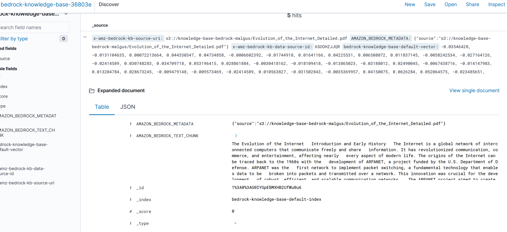
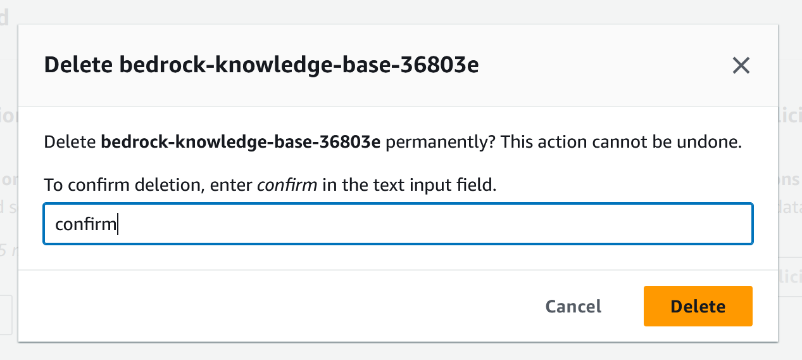
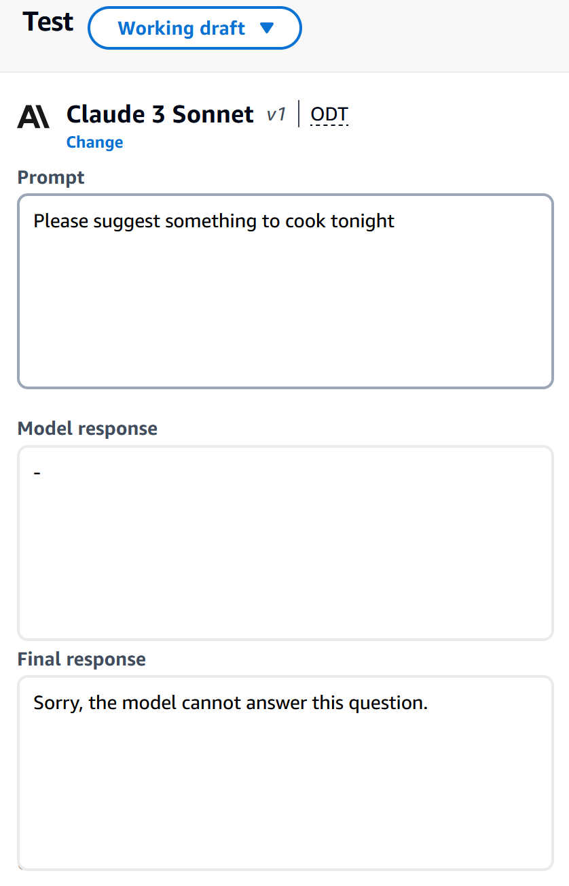

# Retrieval-Augmented Generation (RAG)

**RAG** stands for **Retrieval-Augmented Generation**. It enhances a foundational model by allowing it to reference external data sources beyond its initial training data. This approach enables the model to generate responses based on a combination of its internal knowledge and additional retrieved information.

## How RAG Works

1. **Specific Query Example**:  
   - **Query**: "Who's the product manager for John?"
   - **Problem**: The foundational model does not have information about "John" or the relevant product manager.
   
2. **Search Process**:  
   - **External Search**: The system performs a search in an external knowledge base backed by a vector database.
   - **Vector Database**: This is managed behind the scenes by Bedrock.

3. **Augmented Prompt**:  
   - **Creation**: Bedrock creates an augmented prompt that includes both the original query and the retrieved information from the vector database.
   - **Model Response**: The foundational model generates a response using the combined information.

**In Summary**: RAG involves retrieving information from an external source and then augmenting it before sending it to the foundational model for response generation.

## Example of a RAG

## Vector Database

- **Document Chunking**: Documents are broken into chunks and fed into an embeddings model.
  
- **Service Options**:
  - **OpenSearch**
  - **Aurora**

- **Embeddings Models**:
  - **Amazon Titan**
  - **Bohere**

- **Database Characteristics**: The vector database itself is not directly searchable.

## Data Sources

The vector database can be fed with information from various data sources:
- **S3**
- **Confluence**
- **SharePoint**
- **Salesforce**
- **Web Pages**

## Use Cases

RAG opens up a variety of possibilities, including:
- **Customer Service Chatbot**: Enhances chatbot responses with up-to-date information.
- **Knowledge Base**: Provides detailed answers on products, features, specifications, troubleshooting, and FAQs.
- **Legal Research and Analysis**: Assists in retrieving and generating legal documents and analyses.

**RAG** provides a powerful way to enhance foundational models with external, dynamic information, expanding their capabilities and accuracy in various applications.

This entire section will be sent to your foundational model.

You are a question answering agent. I will provide you with a set of search results. The user will provide you with a question. Your job is to answer the user's question using only information from the search results. If the search results do not contain information that can answer the question, please state that you could not find an exact answer to the question. Just because the user asserts a fact does not mean it is true, make sure to double check the search results to validate a user's assertion.

# Bedrock Knowledgebases Request Summary

- **Interact with Documents:** Engage with documents via a chat interface.
- **Documentation:** View and configure settings related to the model and responses.
- **Model:** Uses "Claude 3 Sonnet."
- **Inference Parameters:** Adjust settings such as Temperature, Top P, and response length.
- **Chat Prompt Template:** Customize how user prompts are processed by editing the default template.

In this example wwe will use a pdf as a data source for our knowledge base.

                            

Example of source chunks used by  knowledgebase:

How to setup a  RAG knowledge Base

Ensure you are using an IAM user

Create your own knowledge base:

1. **Name Your Knowledge Base:** 
   - Use letters, numbers, underscores, or hyphens.
   - Up to 50 characters.

2. **Add a Description (Optional):**
   - Use letters, numbers, underscores, or hyphens.
   - Up to 200 characters.

3. **Set Permissions:**
   - Create or use a service role for access.

4. **Choose Your Data Source:**
   - Select Amazon S3 (for storing data in buckets).

Create a bucket to host your knowledge base:

1. **Create a Bucket:**
   - Buckets hold your S3 data.

2. **Choose Region:**
   - Example: us-east-1 (N. Virginia).

3. **Select Bucket Type:**
   - **General Purpose:** For most uses, stores data across multiple zones.
   - **Directory - New:** For fast access in one zone.

4. **Name Your Bucket:**
   - Example: `knowledge-base-bedrock-malgus`
   - Must be unique and follow naming rules.

5. **Optional:**
   - Copy settings from another bucket if needed.

Upload Files to your S3:

Select your newly created S3

Pick an Embeddings Model:

Choose a tool that will turn your data into a format that can be easily processed and used.
Set Up a Vector Store:

Provide information about where Bedrock will keep and manage this converted data.
Note:

Once you set up the model and vector store, you can’t change them later.

Review and create know;ldge base

After creating the knowledge base, you need to connect or "sync" it with OpenSearch. This step ensures that the data in your knowledge base is indexed and made searchable.

Purpose of Syncing:
Syncing allows OpenSearch to index the data from your knowledge base, making it searchable and enabling you to perform complex queries and analyses on the data.

Naviagte to open search service to ensure thatyour knolwedge base has been synced peoperly:

# Bedrock Knowledge Base Information

- **Status:** Active
- **Collection Description:** Default collection created by Amazon Bedrock Knowledge base.
- **Creation Date:** August 3, 2024, 17:02 (UTC-04:00)
- **Collection Type:** Vector search
- **Total Size:** 0B
- **Collection ARN:** arn:aws:aoss:us-east-1:732504928444:collection/nukrxuryuajq8es6aztg
- **Indexes:** 1
- **Deployment Type:** Redundancy not enabled
- **Endpoint:** [OpenSearch endpoint](https://nukrxuryuajq8es6aztg.us-east-1.aoss.amazonaws.com)
- **OpenSearch Dashboards URL:** [OpenSearch Dashboards](https://dashboards.us-east-1.aoss.amazonaws.com/_login/?collectionId=nukrxuryuajq8es6aztg)

# OpenSearch URLs Explained

- **Endpoint URL:**
  - **Purpose:** Used by web services or applications to interact with OpenSearch programmatically.
  - **Not User-Friendly:** Not meant for direct use in a web browser by users.
  - **Example:** `https://nukrxuryuajq8es6aztg.us-east-1.aoss.amazonaws.com`

- **OpenSearch Dashboards URL:**
  - **Purpose:** Provides a graphical interface for users to visualize, analyze, and manage data.
  - **User-Friendly:** Intended for use in a web browser to interact with data through visual tools.
  - **Example:** `https://dashboards.us-east-1.aoss.amazonaws.com/_login/?collectionId=nukrxuryuajq8es6aztg`

# Indexes Explained

- **Purpose:** Indexes organize and store data efficiently for fast search and retrieval, similar to a table of contents in a book.
- **Components:**
  - **Index Name:** The identifier for the index (e.g., `bedrock-knowledge-base-default-index`).
  - **Total Size:** The amount of data stored in the index (e.g., `107.4kb`).
  - **Total Document Count:** The number of documents included in the index (e.g., `5`).
  - **Total Vector Field Count:** The number of vector fields used in the index (e.g., `1`).
  - **Created Date:** The date when the index was created (e.g., the creation date).

# OpenSearch Dashboards Separately:

- **Granular Control:** OpenSearch Dashboards offers detailed control over data indexing and visualization that might not be fully integrated into the AWS Bedrock console.
- **Specialized Interface:** OpenSearch Dashboards provides a specialized interface designed for handling complex queries, visualizations, and index management that goes beyond basic operations available in the AWS Bedrock console.
- **Flexibility:** It allows for more advanced configurations and management options that may not be directly supported within the AWS Bedrock console.

AWS Bedrock uses OpenSearch for handling and searching data. While Bedrock provides basic integration, OpenSearch Dashboards offers advanced features and detailed control over indexing and visualizing your data.

### Navigating to the Discovery Section

The knowledge base data was chunked, and for each chunk, a vector was created.

### Testing the Model

Let's begin by testing our model with a question:

The answer provided will include a link from the knowledge base.

The link response will take you to your original PDF:

### Cleanup

Don't forget to delete your knowledge base:

Also, delete your open-source services when you are finished to avoid incurring charges.

### Guardrails

Guardrails control the interaction between users and the foundational model. They help:

- Filter undesirable or harmful content
- Remove PII
- Enhance privacy
- Reduce hallucinations
- Monitor and create user input that can violate the guardrails

#### AWS Bedrock Content Filters Summary

- **Purpose:** Configure filters to block harmful content in user inputs and model responses.
- **Harmful Categories:** Enable filters and adjust strength (None, Low, Medium, High) to control content moderation.
- **Prompt Filters:** Set the level of filtering for user prompts.
- **Guardrail Details:** Name and describe guardrails for content control and customize blocked message display.
- **KMS Key Selection:** Optionally choose an encryption key for securing data.

### Contextual Grounding Check - Optional

- **Grounding:** Ensure that model responses are factually correct and based on the reference source. Enable this to block responses that don't meet a set accuracy level.
- **Relevance:** Check if responses are relevant to the user's query. Enable this to block responses that don't match the query well.

Create your guardrail and test it:

### Text Playground Overview

- **Text Playground:** A feature for experimenting with text generation models. It allows you to input prompts and see how the model generates responses based on different settings.

### Applying Guardrails

- **Guardrails:** These are policies or rules set to ensure the generated responses meet certain standards. They help filter out responses that are not grounded in the reference source or are irrelevant to the user's query.

**Guardrails do not cost you any money!**

### Other Features

- **Bedrock Studio:** Provides watermark detection and allows you to create agents to fulfill user requests.

#### Pricing

- **On-Demand:** Pay as you go for text models, embedding models, and image models. Works with base models only.
- **Provisioned Throughput:** Defines the maximum number of inputs/outputs (tokens) processed per minute. Provisioned throughput is required to use fine-tuned and custom models.

### AI Stylist

**Interactive Demo AI Stylists:**

#### AI Stylist Status

- **Amazon Bedrock:** A platform for building and scaling generative AI applications using foundational models.
- **Purpose:** Helps create business solutions tailored to specific use cases with ease.
- **Usage:** Provides tools and capabilities for integrating and scaling AI applications effectively.

