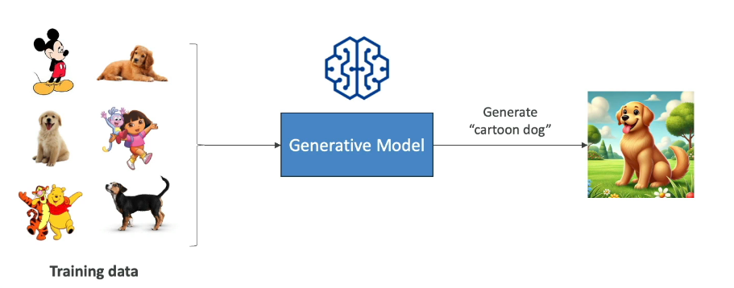
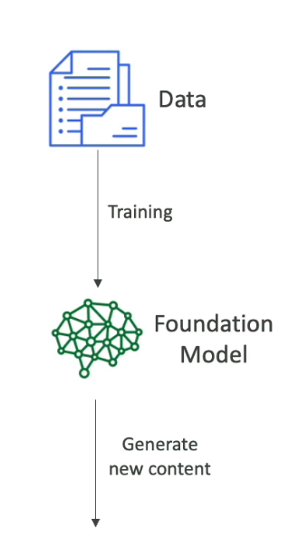
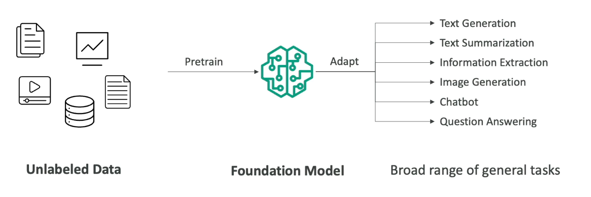
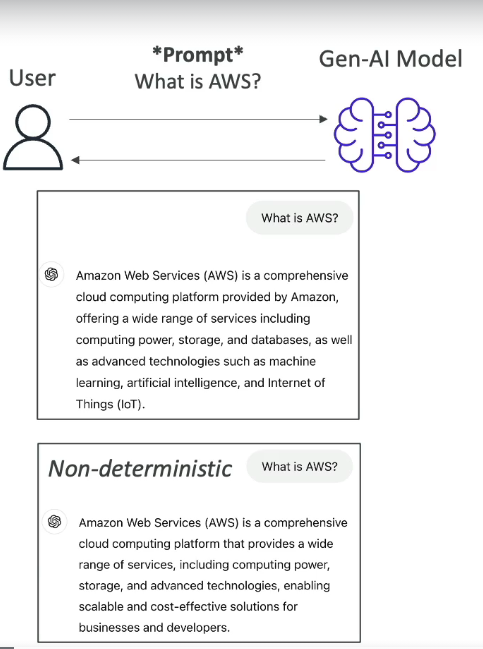
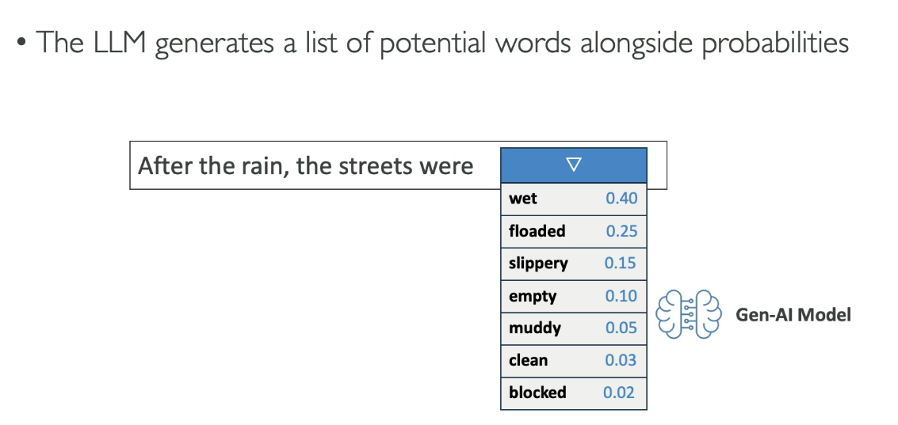
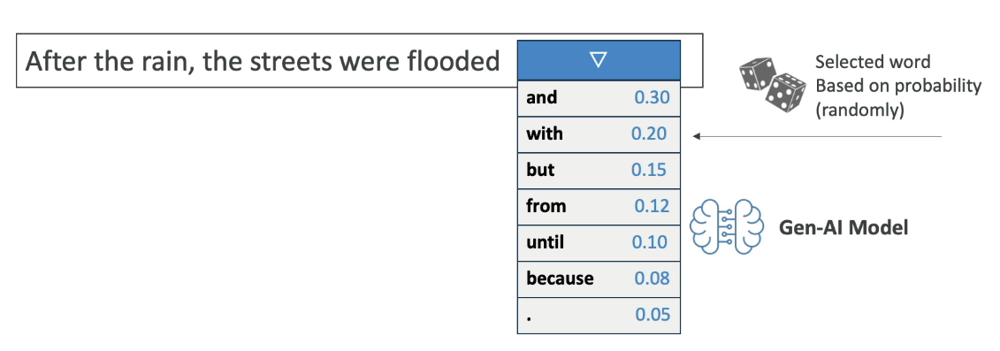
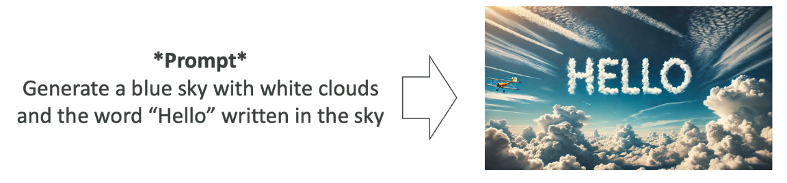
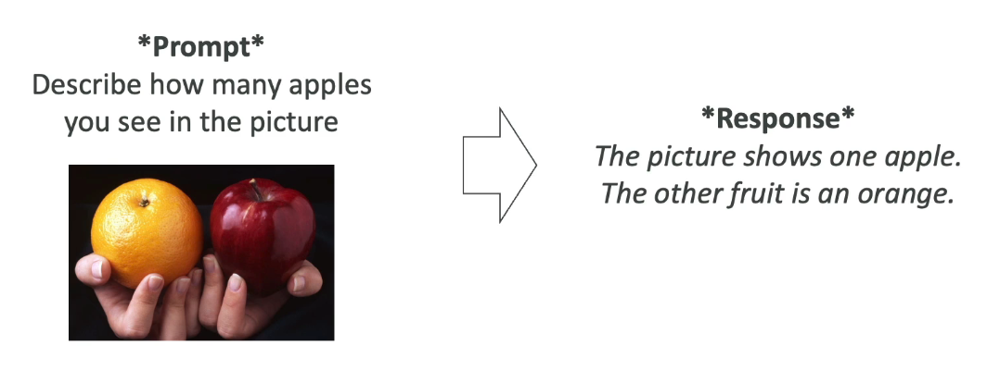
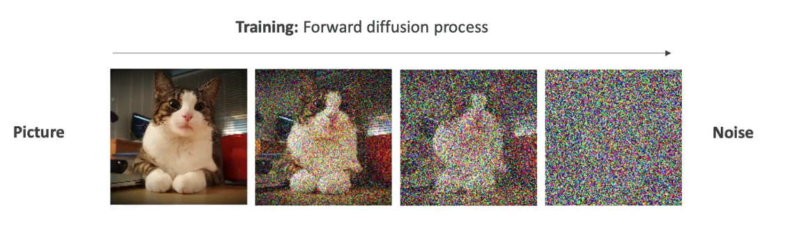
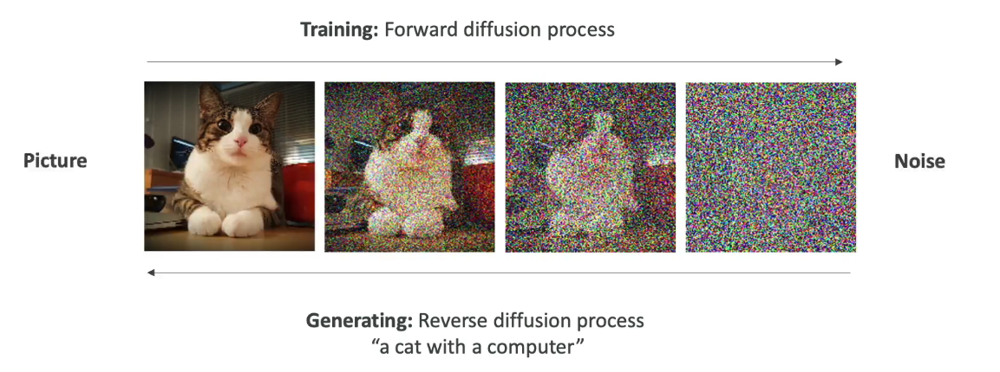

# AI Overview

- **AI:** Artificial Intelligence, the broad field focused on creating systems that can perform tasks typically requiring human intelligence.

- **Machine Learning (ML):** A subset of AI that uses algorithms to enable systems to learn and improve from experience without being explicitly programmed.

- **Deep Learning (DL):** A specialized branch of ML involving neural networks with many layers, designed to model complex patterns and representations.

- **Generative AI (GAI):** A subset of DL that generates new data similar to the training data, such as images, text, or audio, based on learned patterns.

# Generative AI Overview

Generative AI is a subset of Deep Learning, which is a subset of Machine Learning, which is a subset of AI.

- **AI**
- **Machine Learning (ML)**
- **Deep Learning (DL)**
- **Generative AI (GAI)**

## Purpose of Generative AI

Generative AI is used to generate new data that is similar to the data it was trained on. This data may include:

- Text
- Images
- Audio
- Code
- Video
- & more

**Example:** If you input dog images, both real and cartoon, the generative model learns what a dog is. This is known as "training data." Consequently, when you ask the model to generate an image of a 'cartoon dog,' it can create one based on the training data you provided.

> **Note:** Generative AI can combine its knowledge in new and unique ways.

## Training with Foundational Models

We will begin with unlabeled data and "pretrain" a foundational model.

Foundational models are very broad and adaptive. They can handle a wide range of general tasks, such as:

- Generate text
- Extract text
- Summarize text
- Generate images
- Chatbots
- Answer questions

**Foundational Models:** Training a foundational model may literally cost several million dollars. For example, ChatGPT-4 is the foundational model behind ChatGPT.

### Companies and Models

- **OpenAI**
- **Meta**
- **Amazon**
- **Google**

These companies have adequate resources to create large models. There are also open-source foundational models available, such as:

- **Meta**
- **Google BERT**

Some models require a commercial license:

- **OpenAI**
- **Anthropic**
- **Others**

Some require a commercial license:

Side Note: "What's the difference between Bert & Bard"

# Google BERT vs Google Bard

| Feature       | Google BERT                       | Google Bard                       |
|---------------|----------------------------------|----------------------------------|
| **Type**      | Open-Source Model                 | Proprietary Service               |
| **Repository**| [GitHub Repository](https://github.com/google-research/bert) | Not Available                     |
| **License**   | Apache 2.0                        | Not Applicable                    |
| **Access**    | Download and modify               | Access through Google's platforms |
| **Usage**     | Natural Language Processing (NLP) | Conversational AI                 |

## Summary

- **Google BERT** is an open-source model for natural language processing, available on GitHub under the Apache 2.0 license. You can download, modify, and use it as needed.

- **Google Bard** is a proprietary service that is part of Google's suite of tools. It is not open-source, and users interact with it through Google's platforms without access to the underlying source code.

Note: *Bard is now called "GEMINI"

# LLM's:

- **Large Language Models (LLM):** A type of AI designed to generate coherent, human-like text.

Large Language Models are trained on very large amounts of text data. They are very large models that are computationally heavy and are trained via books, articles, websites, etc. They can perform a wide range of language-related tasks, including:
  - Translation
  - Summarization
  - Q/A
  - Content Creation

## How the Process Works

We provide the LLM with a "prompt," for example: "What is AWS."

The output is non-deterministic, meaning the resulting text may vary for each user using the same prompt.

The LLM generates a list of words along with associated probabilities. An algorithm will select a word from the list.

  

This selection method is statistical in nature.

## Images from Text Prompts

## Images Generated from Images

## Text from Images

There are different models used for this process. One popular method is called "Diffusion: Ex-Stable Diffusion."

# What Is Forward Diffusion?

Imagine you have a clean, clear picture, but you start to mess it up by adding random noise (like static on a TV). As you add more noise, the picture gets blurrier and less recognizable. This process of gradually adding noise to a picture is called Forward Diffusion.

## How It Works:

1. **Starting Point**: You begin with a clear image.
2. **Add Noise**: Gradually, you add random noise to the image. Over time, the image gets more and more distorted until it's just a noisy mess.

## What Happens Next?

Once you’ve learned how to mess up the picture (adding noise), you can also learn how to do the opposite:

- **Reverse the Process**: You start with a noisy mess and use what you’ve learned to clean it up and turn it back into a clear image.

## Summary:

(Training)
- **Forward Diffusion**: Takes a clear image and makes it noisy.

(Inference)

- **Reverse Diffusion**: Takes a noisy image and cleans it up to make it clear again.

So, in simple terms, it's like learning how to turn a picture into static and then back again.
hen reverse the process and go from noise to image

