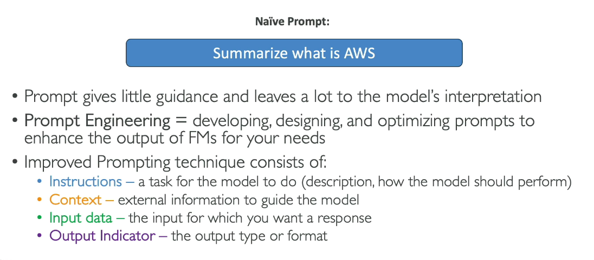
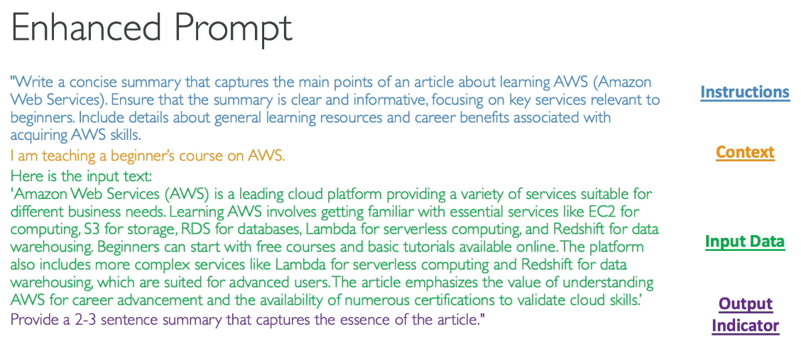
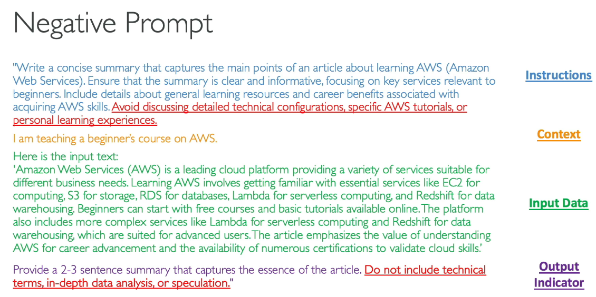
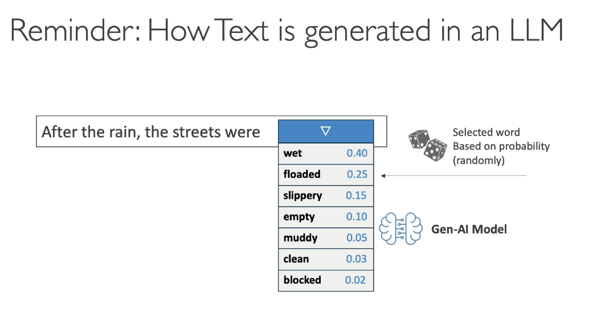
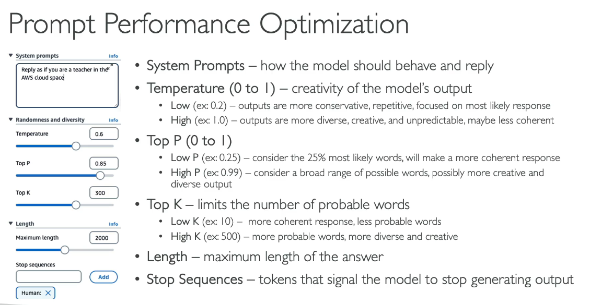

## Prompt Engineering Overview

**Basic Prompt**:  
A naive prompt is simply submitted to a Language Model (LLM) without much guidance. For instance, asking "Tell me about climate change" provides very broad output with minimal direction.

**Prompt Engineering**:  
Prompt engineering involves developing, designing, and optimizing prompts to enhance the performance of Foundation Models (FMs) based on specific needs.

**Components for Effective Prompt Engineering**:
1. **Instructions**: Clear directives on what you want the model to do.
2. **Context**: Background information or setting to help the model understand the scenario.
3. **Input Data**: Specific information or data points the model should use.
4. **Output Indicator**: Guidelines on how the model's response should be structured or formatted.



**Enhanced Prompt Example**:


**Instructions**: Provide a detailed analysis of the effects of climate change on coastal cities.

**Context**: Climate change is causing sea levels to rise and increasing the frequency of extreme weather events. Coastal cities are at high risk due to their geographical locations.

**Input Data**: Include recent statistics on sea level rise, data on increased storm frequency, and specific examples of affected cities (e.g., Miami, New York, Tokyo).

**Output Indicator**: The response should be structured as a comprehensive report with an introduction, detailed analysis by city, and a conclusion summarizing the potential future impacts. Use bullet points for key statistics and include references to recent studies where applicable.

**Example Enhanced Prompt**:  

```
Provide a detailed analysis of the effects of climate change on coastal cities. Climate change is causing sea levels to rise and increasing the frequency of extreme weather events. Coastal cities are at high risk due to their geographical locations. Include recent statistics on sea level rise, data on increased storm frequency, and specific examples of affected cities such as Miami, New York, and Tokyo. The response should be structured as a comprehensive report with an introduction, detailed analysis by city, and a conclusion summarizing the potential future impacts. Use bullet points for key statistics and include references to recent studies where applicable.
```

Enhanced Prompt example:





### Negative Prompt

**Definition**:  
Negative prompts involve explicitly instructing the model on what not to include or do in its response.

**Purpose**:
- **Avoid Unwanted Content**: Prevent the model from generating irrelevant or inappropriate information.
- **Maintain Focus**: Help the model stay on topic by avoiding digressions.
- **Enhance Clarity**: Prevent the use of complex terminology or jargon that might confuse the response.

**Example of Negative Prompt Engineering**:

**Prompt with Negative Instructions**:  
"Explain the impact of climate change on coastal cities, but do not include any historical data or discuss political aspects. Avoid using complex scientific terms and focus on recent statistics and practical effects."

This example instructs the model to exclude certain topics (historical data, political aspects) and avoid complex terminology, ensuring the response remains relevant, focused, and clear.



Hands on:

# Tutorial: Effective Prompting for AI Models

## Introduction

In this tutorial, we will practice creating effective prompts to get the best results from an AI model. We'll walk through an example of crafting a travel itinerary and explore how to improve prompt quality using both positive and negative prompting techniques.

## Steps

### 1. Start with a Basic Prompt

1. **Open Chat Interface**: Navigate to the chat interface of the AI model.
2. **Select Model**: Choose the model, for example, Anthropic’s Claude 3 Haiku.
3. **Write a Simple Prompt**: Enter a basic prompt such as "Write me a travel itinerary."

   **Example Output**:  
   The model might generate a seven-day trip itinerary covering Rome, Florence, and Venice. This response is possible but not detailed enough.

### 2. Enhance the Prompt with a Framework

1. **Define Instructions**: Be specific about what you want.  
   **Example**: "Create a three-day itinerary for Paris, France. Include visits to historical landmarks, art museums, and popular local restaurants. Provide suggestions for breakfast, lunch, and dinner."

2. **Provide Context**: Explain any relevant background information.  
   **Example**: "We have never traveled to Paris before and want to experience both well-known and hidden gems."

3. **Add Input Data**: Include any additional information or preferences.  
   **Example**: "The input is a three-day trip to Paris. Articles or references could further enhance the itinerary."

4. **Specify Output Format**: Describe the desired format of the result.  
   **Example**: "The itinerary should include specific times, locations, descriptions, and dining recommendations."

   **Example Enhanced Output**:  
   The model will now generate a detailed itinerary for Paris, including specific activities and dining options.

### 3. Apply Negative Prompting

1. **Define What to Avoid**: Specify what should not be included in the response.  
   **Example**: "Do not include activities primarily for children or families. Avoid overly touristy restaurants and anything requiring extensive travel, except for Versailles."

2. **Run the Prompt**: Test the refined prompt with negative instructions.

   **Example Output**:  
   The output should now avoid unwanted elements and may provide a more tailored and concise itinerary.

### 4. Experiment with Additional Negative Prompting

1. **Add More Constraints**: Try additional negative constraints to further refine the response.  
   **Example**: "Do not recommend more than three activities per day."

2. **Evaluate the Results**: Compare the results with and without negative prompting to see how it affects the itinerary.

   **Example**:  
   The modified prompt will likely result in a shorter and more focused daily schedule, possibly providing more free time.

## Conclusion

By using these techniques, you can craft more effective prompts to get precise and relevant responses from AI models. Experiment with different instructions, contexts, and constraints to optimize your prompts for various needs.


# Tutorial: Optimizing Prompt Performance in AI Models

## Introduction

In this tutorial, we will explore how to enhance the performance of prompts in AI models. We'll dive into how text generation works and how to influence it using different parameters available in platforms like Amazon Bedrock.

## Understanding Text Generation

When an AI model generates text, it predicts the next word based on probabilities. For example, given the sentence "After the rain, the streets were," the model might choose from words like "wet," "flooded," or "muddy," each with associated probabilities.



## Parameters for Optimizing Prompt Performance

### 1. System Prompts

- **Definition**: Specifies how the model should behave or respond.
- **Example**: Set the system prompt to "Reply as if you are a teacher in the AWS cloud space" to guide the tone and style of responses.

### 2. Temperature

- **Definition**: Controls the creativity of the model’s outputs, ranging from 0 to 1.
  - **Low Temperature (e.g., 0.2)**: Produces more conservative and predictable responses.
  - **High Temperature (e.g., 1.0)**: Results in more diverse and creative responses, but can be less coherent.

### 3. Top P

- **Definition**: Sets a probability threshold to limit the selection of words.
  - **Low Top P (e.g., 0.25)**: Considers only the top 25% most likely words, leading to more coherent responses.
  - **High Top P (e.g., 0.99)**: Includes a broader range of words, resulting in more creative outputs.

### 4. Top K

- **Definition**: Limits the number of most probable words considered.
  - **Low Top K (e.g., 10)**: Restricts to the top 10 words, producing more coherent responses.
  - **High Top K (e.g., 500)**: Considers the top 500 words, increasing diversity and creativity.

### 5. Length

- **Definition**: Sets the maximum length of the generated response.

### 6. Stop Sequences

- **Definition**: Defines tokens that signal the model to stop generating text.

***Important for EXAM***



## Summary

- **Temperature**: Adjusts creativity and coherence.
- **Top P**: Controls the probability threshold for word selection.
- **Top K**: Limits the number of probable words considered.
- **Length**: Sets the maximum response length.
- **Stop Sequences**: Determines when the model should stop generating text.
- **System Prompts**: Guides the behavior and tone of the response.

## Conclusion

Understanding and adjusting these parameters will help you fine-tune the performance of your AI model prompts to better meet your needs.


# Influencing Model Creativity with Configurations

## Introduction

Use the example of a short story about a robot learning how to cook to see how adjusting parameters affects the output.

## Example Setup

1. **Select Model**: Choose Anthropic and Claude 3 Sonnet.
2. **Initial Prompt**: "Please write a short story about a robot learning how to cook."
3. **Maximum Length**: Set to 600 to keep the story concise.

## Initial Configuration

- **Temperature**: Low
- **Top P**: Low
- **Top K**: Low

These settings will make the response more conservative.

### Output with Initial Settings

- **Story Example**: "There is a kitchen, and a chef is bustling with activity..."
- **Observation**: The story might seem a bit boring or predictable.

## Adjusting Configurations for Creativity

1. **Increase Temperature**: Set to a higher value to enhance creativity.
2. **Increase Top P**: Set to a higher value (close to 1) to consider a broader range of words.
3. **Increase Top K**: Set to a higher value (e.g., 500) to include more words for selection.

### Creative Output with Adjusted Settings

- **Revised Prompt**: "Please write a short story about a robot learning how to cook."
- **Story Example**: "The robot, equipped with optical sensors, is guided by an instructor through making crepes, and ends up enjoying the experience..."


- **Temperature**: Controls the creativity of the output. Higher values increase creativity.
- **Top P**: Defines the percentile of words considered based on their probabilities. Higher values include more diverse words.
- **Top K**: Limits the number of words considered for selection. Higher values offer more variety.


By adjusting these parameters, you can influence the level of creativity in your model’s outputs. Experiment with different settings to see how they affect your results.


# Advanced Prompt Engineering Techniques


## Zero-Shot Prompting

**Zero-Shot Prompting** involves presenting a task to the model without providing any examples or explicit training for that task. 

### Example

- **Prompt**: "Write a short story about a dog that helps solve a mystery."
- **Response**: "Once upon a time, there was a clever dog named Max..."

This technique relies solely on the model’s general knowledge. The larger and more capable the model, the better the response.

## Few-Shot Prompting

**Few-Shot Prompting** provides the model with examples of the task to guide its output. This approach is useful when you want the model to follow specific patterns or styles.

### Example

1. **Examples Provided**:
   - **Story 1**: Whiskers the Cat solves a mystery.
   - **Story 2**: Buddy the Bird helps find a lost item.

2. **Prompt**: "Write a short story about a dog that helps solve a mystery."

By providing a few examples, the model is guided to produce a response that aligns with the given examples.

- **Response**: "In a bustling city, a brave dog named Rex discovered clues to solve a local mystery..."

## Chain of Thought Prompting

**Chain of Thought Prompting** involves breaking down the task into a sequence of reasoning steps to enhance structure and coherence.

### Example

- **Prompt**: "Write a short story about a dog solving a mystery. First, describe the setting and the dog. Then, introduce the mystery. Next, show how the dog discovers clues. Finally, reveal how the dog solves the mystery and concludes the story."

This approach helps the model follow a structured thought process, leading to a more organized and coherent response.

- **Response**: "The story begins in a quaint town with a smart dog named Max. The mystery unfolds as Max uncovers clues and solves the case..."

## Retrieval-Augmented Generation (RAG)

**RAG** combines the model’s capabilities with external data sources to create a more informed and contextually rich response.

### Example

1. **Prompt**: "Write a short story about a dog solving a mystery. Use the following information: Dogs have an excellent sense of smell, common mysteries involve theft, and they can track scents even from a day old."

2. **Augmented Information**: Details about dogs' abilities and common mystery themes are retrieved from external sources and added to the prompt.

- **Response**: "Max, the dog with an extraordinary sense of smell, tracks down clues in a mystery involving stolen items. His keen nose helps him solve the case..."


- **Zero-Shot Prompting**: No examples provided; relies on general knowledge.
- **Few-Shot Prompting**: Provides a few examples to guide the output.
- **Chain of Thought Prompting**: Breaks the task into structured steps.
- **Retrieval-Augmented Generation (RAG)**: Combines model capabilities with external data for enriched responses.


These techniques allow you to refine the responses generated by AI models. Experiment with different approaches to see how they impact the quality and relevance of your results.

