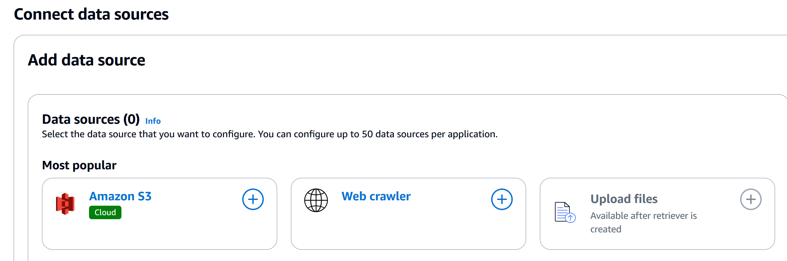

Satrt of by enableing IAM Ideitty Cneter

Click “Enable IAM Identity Center”: Follow the on-screen instructions to enable IAM Identity Center. This will set up the necessary infrastructure and configurations needed for integration with other AWS services, including Amazon Q Business.

nvigate to amazon Q business 

select create applicaiotn

we will call it demo aplcaiton

 **Application Name**: `demo-application` 
- **Service Access**: 
  - **Authorization**: Create and use a new service-linked role (SLR).
- **Encryption**: 
  - Default AWS-managed KMS key; no custom settings.
- **IAM Identity Center**: 
  - Default option; no organization instance created.
- **Tags**: 
  - No tags added.
- 

In our exmaple we will use S3

Choose an index based on your application's needs, as it cannot be changed later. Provisioned index units incur charges regardless of usage.

Enterprise Index: Best for production with high uptime and encrypted storage, supports up to 1 million documents with multi-availability zone deployment.
Starter Index: Suitable for non-production tasks like testing, supports up to 100,000 documents with single availability zone deployment.

we will use standar din our dfemo
and 1 unit:

Number of units
Available index unit range is 1 to 5 units. Each unit is 20,000 documents or 200 MB, whichever comes first.

Select the data source that you want to configure. You can configure up to 50 data sources per application.

THE Service role ill allow AMAZN Q to access s3 

data source was sucessfully added

click next

we ned to determein whoh can acces our resources

This new role would manage permissions necessary for handling billing information and service usage reporting, ensuring that Amazon Q Business can access and manage billing-related data efficiently.

OUr applciaiton ahs been created now it need ssynced , now we need to synced

Note: Ecnsur etahty ou have the necessary dfiel suploaded ot the bucket prior to syching:

after intiatiing hte synch we will now
ad users and groups

we sucessfully adeed  user:

accpet the email invite and set up a pasowrd:

check th identity center dashboard to see your user name

we will go to next expeience setting
and clic ok on the url

This sthe logn portal of maazon Q buiness

REGISTER YOUR MFA DEVICE

you should see the buinseess q DASBOARD AND cHAT ui

Lets test our app

MAKE NOTE OF THE REFERNCE NOTATIONS AS CLICKABEL LINKS: 

# Amazon Q Apps (Q Business) Overview

- **No-Code App Creation**: Build Generative AI-powered applications using natural language commands, without needing to code.
- **Leverages Internal Data**: Utilizes your company's own data to tailor and enhance the app’s functionality.
- **Plugin Integration**: Supports plugins (e.g., Jira) to extend the app’s capabilities and integrate with existing tools.

## Benefits

- **Ease of Use**: Simplifies app development, making it accessible to non-developers.
- **Customization**: Allows apps to be customized with internal data for more relevant and accurate results.
- **Integration**: Connects with existing tools to enhance functionality and streamline workflows.

## Use Cases

### Customer Support
Create chatbots that provide support using internal knowledge and systems.

### Project Management
Integrate with tools like Jira to automate task management and reporting.

### Employee Assistance
Develop internal apps that help employees quickly access company resources and information.

## Example Apps for HR Scenarios

1. **Employee Onboarding Assistant**
   - **Function**: Guides new hires through the onboarding process with information about company policies, necessary paperwork, and training schedules.
   - **Integration**: Connects with HR systems and training modules.

2. **Leave Request Bot**
   - **Function**: Automates the leave request process by allowing employees to submit and track leave requests through a chatbot.
   - **Integration**: Syncs with leave management systems and calendars.

3. **HR Query Resolution**
   - **Function**: Answers common HR-related questions, such as benefits, payroll, and company policies, using internal data.
   - **Integration**: Accesses internal knowledge bases and policy documents.

4. **Performance Review Scheduler**
   - **Function**: Assists in scheduling and managing performance reviews, sending reminders and collecting feedback.
   - **Integration**: Links with performance management systems and email.

5. **Training and Development Planner**
   - **Function**: Helps employees find and register for training sessions and development programs based on their roles and career goals.
   - **Integration**: Connects with training databases and employee profiles.

Here is an example prompt: I need an app to handle common HR-related questions for employees. The app should:

- Answer frequently asked questions about benefits, payroll, and company policies.
- Access and utilize internal knowledge bases and policy documents for accurate information.
- Be easily integrated into our current HR systems and accessible to all employees.

Please create an Amazon Q App that fulfills these requirements, allowing us to streamline HR inquiries and improve efficiency.

# Test Questions for HR Query Resolution App

## Benefits Inquiry
- "What benefits are available to full-time employees?"
- "Can you provide details on our health insurance options?"

## Payroll Information
- "When is the next payroll cycle?"
- "How can I access my pay stubs?"

## Company Policies
- "What is the company's policy on remote work?"
- "Can you explain the process for requesting time off?"

## Training and Development
- "What training programs are available for new hires?"
- "How can I enroll in professional development courses?"

## General HR Questions
- "Who should I contact for issues with my benefits enrollment?"
- "What are the steps for changing my personal information in the HR system?"

## sample rsults

you have t eoptiotn to ssav your created cusotm app
you now have a libray of apps

Tear down your resources
first make sure youfind you user and unsubscribe htem so there are no addional incurred charges

# Amazon Q Developer Overview

- **AWS Documentation & Service Selection**: Answers questions about AWS documentation and selecting AWS services.
- **Resource Management**: Provides information about resources in your AWS account.
- **CLI Suggestions**: Recommends CLI commands to make changes to your AWS account.
- **Billing & Troubleshooting**: Assists with bill analysis, error resolution, and troubleshooting.

## Additional Features

- **AI Code Companion**: Helps code new applications with real-time suggestions, similar to GitHub Copilot. Supports languages like Java, JavaScript, Python, TypeScript, and C#.
- **Code Assistance**: Offers code completions, security scans, feature implementation, documentation generation, and project bootstrapping.

## IDE Extensions

- **IDE Integration**: Integrates with IDEs to assist with software development.
- **Development Support**: Provides AWS development answers, code completions, security vulnerability scans, and debugging.

