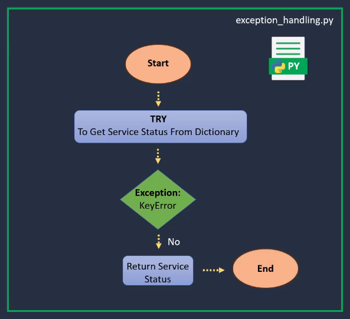

# Exception Handling in Python

Exception handling in Python can help us maintain the flow of our program, increase the robustness of our code, and gracefully handle errors.

## What Are Exceptions?

In Python, exceptions are runtime errors that disrupt the normal flow of a program. Python provides a wide set of built-in exceptions that are triggered in response to specific error events. Some common built-in exceptions include:

- **ZeroDivisionError**: Raised when attempting to divide by zero.
- **FileNotFoundError**: Raised when trying to access a file that does not exist.
- **KeyError**: Raised when trying to access a non-existent key in a dictionary.

These built-in exceptions are quite self-explanatory by their names. However, Python also allows us to create custom exceptions by inheriting from a parent exception class.

## Why Is Exception Handling Important?

1. **Graceful Error Handling**: Instead of crashing suddenly when an error occurs, exception handling allows us to fail gracefully, providing user-friendly error messages to aid in troubleshooting.
2. **Increased Robustness**: It helps in creating a program that can withstand unexpected inputs or system conditions.
3. **Maintaining Program Flow**: Structured exception handling helps redirect the program in case of minor issues, thus maintaining its overall flow.

## Real-World Example

Let's consider a real-world scenario involving a Python script for cleaning up AWS S3 logs. Suppose we have several AWS services generating daily logs stored in an S3 bucket. We want to implement a cleanup script to:

1. Identify and flag logs that need to be sent to relevant parties in our organization.
2. Identify which subset of these files needs to be moved to a more cost-effective solution such as S3 Glacier.
3. Decide that any remaining files should be deleted.

What if we anticipate the possibility of an error scenario in which these daily logs are no longer being stored in our S3 bucket directory? We could code a try-except block into our Python script using the built-in `FileNotFoundError` exception.

The `try` portion of our code would attempt to open a log file in our S3 directory. If it fails (i.e., the file is not found), the `FileNotFoundError` exception block would kick in, allowing us to handle the error gracefully and alert our support team, maintaining the program's flow without crashing it.


## Example Code

Here's an example of how you could code this `try-except` block:

```python
# Think of the try block as the part of the code that is being tested for potential errors.
try:
    # Attempt to open the AWS service log file
    # 'file' is the variable name assigned to the file object.
    with open('aws_service_log.txt', 'r') as file:
        log_data = file.read()
        # Reads the entire content of the file. ie:
        # Processes the log file
except FileNotFoundError as e:
    # Handle the error if the file is not found
    # In this case, FileNotFoundError is a specific type of exception. 
    # It occurs when the code in the try block tries to # open a file that does not exist.
    # 'e' is a placeholder for the FileNotFoundError
    print(f"Error: {e}")
    # Code to alert the support team about the missing file
    # The actual alerting or notification code is something you would add separately 
    # to inform the support team about the issue
```


The try block is where we attempt to perform an operation (opening and reading a file).
If something goes wrong (like the file not being found), the except block handles the error by showing a message and possibly doing other things like notifying a support team.


## Learning More

There are many more built-in exceptions beyond `ZeroDivisionError`, `FileNotFoundError`, and `KeyError`. To learn more about Python's built-in exceptions, you can refer to the official documentation.

Search for "Python built-in exceptions" in your preferred search engine. The first result is usually the official Python documentation, which provides comprehensive information on built-in exceptions and how to create custom exceptions.


## Graceful Exception Handling in AWS Service Status Retrieval with Python
The Python script demonstrates how to use a `try - except` block to handle exceptions while retrieving AWS service statuses from a dictionary (`aws_services_statuses`). It gracefully manages cases where a service name does not exist in the dictionary by providing a user-friendly error message. This approach ensures that the script does not crash due to unexpected issues and maintains smooth execution.




```python
# Sample dictionary with AWS service statuses
aws_services_statuses = {
    'AmazonS3': 'Operational',
    'AmazonEC2': 'Degraded',
    'AmazonRDS': 'Operational',
    'AmazonLambda': 'Service Disruption'
}

# def: Starts the function definition.
# get_service_status: The name of the function.
# service_name: The parameter for the function. This is the value # that the function will use when it is called.
def get_service_status(service_name):
    try:
        # Attempt to retrieve the service status from the dictionary
        status = aws_services_statuses[service_name]
        return f"The status of {service_name} is: {status}"

    except KeyError:
        # Handle the case where the service name does not exist in the dictionary
        return f"Error: The service '{service_name}' does not exist in the dictionary."

    except Exception as e:
        # Handle any other unexpected errors
        return f"An unexpected error occurred: {str(e)}"

# Examples of using the function
service_names = ['AmazonS3', 'AmazonEC2', 'AmazonUnknown', 'AmazonLambda']

for service in service_names:
    result = get_service_status(service)
    print(result)
```

# Summary of Python Script

## Purpose
The script retrieves the status of AWS services from a dictionary and handles errors gracefully.

## Dictionary
- Contains service names and their statuses (`aws_services_statuses`).

## Function (`get_service_status`)

### Input
- Service name.

### Process
- Tries to get the status from the dictionary.
- Catches `KeyError` if the service is not in the dictionary.
- Catches any other exceptions to handle unexpected errors.

### Output
- Returns a message with the status or an error message.

## Execution
- Iterates over a list of service names, calls the function for each, and prints the result.

## Design
- Ensures that the script can handle missing services and unexpected errors without crashing.
