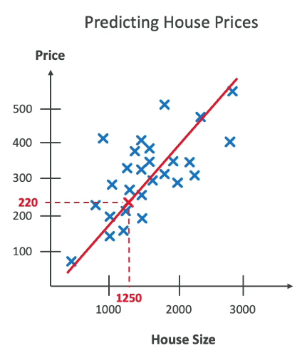

# Introduction to Artificial Intelligence (AI)

## What is AI?

Artificial Intelligence (AI) is a broad field focused on developing intelligent systems that can perform tasks typically requiring human intelligence, such as:

- **Perception**
- **Reasoning**
- **Learning**
- **Problem Solving**
- **Decision Making**

AI is an umbrella term encompassing various techniques. It includes:

- **Machine Learning (ML)**
- **Deep Learning (DL)**
- **Generative AI (GenAI)**

## Use Cases of AI

Some common AI use cases are:

- **Computer Vision**: Self-driving cars, facial recognition
- **Fraud Detection**
- **Intelligent Document Processing (IDP)**

## How AI Works

1. **Data Layer**: Collect vast amounts of data.
2. **Machine Learning Framework/Algorithm Layer**: Define and choose frameworks/algorithms.
3. **Model Layer**: Implement and train the model with defined parameters.
4. **Application Layer**: Expose the model to users.

## What is Machine Learning (ML)?

Machine Learning (ML) is a type of AI that builds methods allowing machines to learn from data. It improves performance on tasks through data-driven predictions. Examples include:

- **Regression**: Predicting values (e.g., fitting a line to data points).
- **Classification**: Categorizing data (e.g., separating data into categories like blue or orange).

## What is Deep Learning (DL)?

Deep Learning (DL) is a subset of ML that uses neural networks inspired by the human brain. It can process complex patterns in data with multiple layers:

- **Input Layer**: Receives data.
- **Hidden Layers**: Processes data through connections and neurons.
- **Output Layer**: Produces the result.

Deep learning requires large datasets and is computationally heavy, often using GPUs for efficient processing.

## Neurons and Synapses
- **Concept**: Deep Learning uses artificial neurons and synapses, similar to those in our brain, to build and train models. Neurons are basic units that receive inputs, process them, and pass the output to other neurons.
- **Layers**: These neurons are organized in layers: the input layer, multiple hidden layers, and the output layer.

## Processing Complex Patterns
- **Capability**: DL can process and recognize more complex patterns in data compared to traditional ML techniques.
- **Reason**: This is due to the depth of layers (hidden layers) in DL models, which allow for more intricate data processing.

## Deep Learning Layers
- **Layers**: The term "deep" in Deep Learning refers to the presence of multiple layers (input, hidden, and output) within the model.
- **Example**: A neural network might have dozens or even hundreds of hidden layers.

## Applications
- **Computer Vision**:
  - **Image Classification**: Categorizing images into predefined classes.
  - **Object Detection**: Identifying and locating objects within an image.
  - **Image Segmentation**: Dividing an image into segments based on different objects or features.
- **Natural Language Processing (NLP)**:
  - **Text Classification**: Assigning categories to text based on its content.
  - **Sentiment Analysis**: Determining the sentiment expressed in text (e.g., positive, negative).
  - **Machine Translation**: Translating text from one language to another.
  - **Language Generation**: Creating text that mimics human writing.

## Data and Computational Requirements
- **Data**: DL models require large amounts of input data to train effectively.
- **Hardware**: Due to the complexity and computational demands, DL often requires a Graphics Processing Unit (GPU) for efficient training.

# Neural Networks – How Do They Work?

Neural Networks are the backbone of Deep Learning. Here’s a simple guide to understanding their operation:

## Nodes and Layers
- **Nodes**: Tiny units in a neural network that process data. Each node is connected to other nodes, forming a network.
- **Layers**: Nodes are organized into layers:
  - **Input Layer**: Receives initial data.
  - **Hidden Layers**: Intermediate layers where processing occurs.
  - **Output Layer**: Produces the final result.

### Neural Network Overview

1. **Layers**: A neural network is composed of multiple layers of nodes (or neurons):
   - **Input Layer**: Receives the initial data and passes it to subsequent layers.
   - **Hidden Layers**: Perform transformations and feature extractions. The term "deep learning" refers to the presence of multiple hidden layers.
   - **Output Layer**: Produces the final result or prediction based on processed information from the hidden layers.

2. **Connections**: Nodes in each layer are connected to nodes in adjacent layers. These connections have weights that are adjusted during training to enhance model accuracy.

3. **Training**:
   - **Algorithm**: Uses algorithms to adjust connection weights based on errors between predicted and actual outputs.
   - **Process**: Involves iteratively passing data through the network, calculating errors, and updating weights to minimize those errors.

**Summary**: Neural networks consist of layers (input, hidden, output) connected by weighted links, and are trained by adjusting these weights to minimize prediction errors.

## Generative AI (GenAI)

Generative AI is a subset of deep learning involving foundation models that can adapt to various tasks. It uses:

- **Transformers**: Efficiently process sentences by understanding context and relationships between words. Examples include Google BERT and OpenAI ChatGPT.

### Applications

- **Text Generation**: ChatGPT generates human-like text.
- **Image Generation**: Models like diffusion models can generate images from noise.
- **Multi-modal Models**: Handle mixed inputs (e.g., audio, images) and produce mixed outputs (e.g., video, text).

## Human Analogies

- **AI**: Rule-based systems (e.g., if/then rules).
- **ML**: Classifying known patterns (e.g., identifying a dog based on previous knowledge).
- **DL**: Recognizing new patterns based on similarities (e.g., identifying a tiger despite never seeing one before).
- **GenAI**: Generating new content creatively (e.g., creating a poem from scratch).

AI encompasses various levels, from simple rules to complex, creative processes. Understanding these concepts helps grasp how AI functions and evolves.

---
# Transformer Models and Large Language Models (LLMs)

## Transformer Models

- **Definition**: Transformers are a type of neural network architecture designed to handle sequences of data, such as sentences, more effectively.
- **Function**: Unlike older models that process text word by word or in fixed-size chunks, transformers can manage entire sentences or longer sequences at once.
- **Advantage**: This approach allows transformers to better understand context and relationships between words, making data processing more streamlined and efficient.

## Large Language Models (LLMs)

- **Definition**: LLMs, like GPT-3 and GPT-4, are advanced models that often utilize transformer architectures.
- **Function**: These models are designed to understand and generate human-like text based on patterns learned from extensive data.
- **Capability**: They leverage the transformer's ability to capture context and dependencies in sequences, enabling them to process and generate text efficiently.

## ChatGPT

- **Example**: ChatGPT is a practical example of a transformer-based model.
- **Function**: It uses the transformer architecture to process and generate text, allowing it to understand and respond to user queries coherently and contextually.

---

**Note**: Transformer models streamline data processing by handling entire sequences efficiently, and LLMs like ChatGPT utilize this architecture to perform advanced text generation and comprehension tasks.

# Diffusion Models

## Overview

- **Definition**: Diffusion models are a type of machine learning model used to generate and process images.
- **Function**: They work by introducing "noise" into an image, which is essentially pixelation distortion that makes the image unrecognizable.

## Process

1. **Noise Addition**: The model adds noise to the input image, progressively distorting it and making it less recognizable.
2. **Training**: The model iterates on this process, learning to handle and reverse the noise addition. 
3. **Reverse Process**: After training, the model can reverse the noise addition process, essentially creating an image from noise.

## Application

- **Image Generation**: Once trained, diffusion models can generate new images from descriptive prompts by starting with noise and refining it based on the prompts.
- **Example**: The model can create detailed images from textual descriptions, effectively translating text-based prompts into visual representations.

---

**Summary**: Diffusion models introduce noise to images and learn to reverse this process, enabling them to generate images from descriptive prompts by refining noise into coherent visual content.

# Multi-Modal Models Overview

## Definition
Multi-modal models are designed to process and integrate multiple types of inputs simultaneously.

## Input Types
These models can handle a range of inputs, including:
- **Text**: Written or spoken language
- **Images**: Photographs or drawings
- **Audio**: Speech or environmental sounds

## Integration
By combining these diverse inputs, multi-modal models can produce unique and more comprehensive results, leveraging the strengths of each type of data to enhance overall performance and insight.

## Example
An example of a multi-modal model is a system that can analyze a video by understanding both the visual content (images) and the accompanying audio. For instance, such a model can be used to:
- **Video Captioning**: Generate descriptive text for a video by analyzing both the visual scenes and the spoken words.
- **Enhanced Search**: Improve search results by combining text queries with image or audio inputs to provide more accurate and contextually relevant results.

# Machine Learning Overview

## Training Data

- **To train our model, we must have good data.**
- **Garbage in => Garbage out**
- **Most critical stage to build a good model**
- **Several options to model our data, which will impact the types of algorithms we can use to train our models**
- **Labeled vs. Unlabeled Data**
- **Structured vs. Unstructured Data**

# Labeled vs. Unlabeled Data

## Labeled Data
- **Data includes both input features and corresponding output labels.**
- **Example:** Dataset with images of animals where each image is labeled with the corresponding animal type (e.g., cat, dog).
- **Use case:** Supervised Learning, where the model is trained to map inputs to known outputs.

### Unlabeled Data
- **Data includes only input features without any output labels.**
- **Example:** A collection of images without any associated labels.
- **Use case:** Unsupervised Learning, where the model tries to find patterns or structures in the data.

## Structured Data

- **Data is organized in a structured format, often in rows and columns (like Excel).**

### Tabular Data
- **Data is arranged in a table with rows representing records and columns representing features.**
- **Example:** Customers database with fields such as name, age, and total purchase amount.

| Customer_ID | Name  | Age | Purchase_Amount |
|-------------|-------|-----|-----------------|
| 1           | Alice | 30  | $200            |
| 2           | Bob   | 45  | $300            |

### Time Series Data
- **Data points collected or recorded at successive points in time.**
- **Example:** Stock prices recorded daily over a year.

| Date       | Stock Price |
|------------|-------------|
| 01-07-2024 | $197.20     |
| 02-07-2024 | $200.00     |

## Unstructured Data

- **Data that doesn't follow a specific structure and is often text-heavy or multimedia content.**

### Text Data
- **Unstructured text such as articles, social media posts, or customer reviews.**
- **Example:** A collection of product reviews from an e-commerce site.

***Review: Attended a yoga class at the new studio. The instructor was excellent, and the facility was well-maintained. Loved the variety of classes offered. Only downside was the parking situation.***

### Image Data
- **Data in the form of images, which can vary widely in format and content.**
- **Example:** Images used for object recognition tasks.

## ML Algorithms – Supervised Learning

- **Learn a mapping function that can predict the output for new unseen input data.**
- **Needs labeled data: very powerful, but difficult to perform on millions of datapoints.**

### Regression

Regression is a type of supervised learning. Supervised learning involves training a model on a labeled dataset, where the input data is paired with the correct output. The goal is for the model to learn the relationship between the input and output so that it can predict the output for new, unseen data.
- **Example:** What’s the weight of a person who is 1.6m tall? 
- **Based on linear regression:** 60kg

Height (m)
40 50 60
Weight (kg)
10 20 30

### Classification
- **Example:** Which animal is this?
- **Height: 4.5m, Weight: 800kg**
- **Classification Model: Dog, Cat, Giraffe**

## Supervised Learning – Regression

- **Used to predict a numeric value based on input data.**
- **Output variable is continuous, meaning it can take any value within a range.**

### Use Cases
- **Predicting House Prices** – based on features like size, location, and number of bedrooms.
- **Stock Price Prediction** – predicting the future price of a stock based on historical data and other features.
- **Weather Forecasting** – predicting temperatures based on historical weather data.
  

## Supervised Learning – Classification

- **Used to predict the categorical label of input data.**
- **Output variable is discrete, meaning it falls into a specific category or class.**

### Use Cases
- **Binary Classification** – classify emails as "spam" or "not spam".
- **Multiclass Classification** – classify animals in a zoo as "mammal," "bird," "reptile".
- **Multi-label Classification** – assign multiple labels to a movie, like "action" and "comedy".

Classification Model

## Training vs. Validation vs. Test Set

### Training Set
- **Used to train the model.**
- **Percentage:** Typically, 60-80% of the dataset.
- **Example:** 800 labeled images from a dataset of 1000 images.

### Validation Set
- **Used to tune model parameters and validate performance.**
- **Percentage:** Typically, 10-20% of the dataset.
- **Example:** 100 labeled images for hyperparameter tuning.

### Test Set
- **Used to evaluate the final model performance.**
- **Percentage:** Typically, 10-20% of the dataset.
- **Example:** 100 labeled images to test the model's accuracy.

Dataset
80% Training Set

## Feature Engineering

- **The process of using domain knowledge to select and transform raw data into meaningful features.**
- **Helps enhance the performance of machine learning models.**

### Techniques
- **Feature Extraction** – extracting useful information from raw data, such as deriving age from date of birth.
- **Feature Selection** – selecting a subset of relevant features, like choosing important predictors in a regression model.
- **Feature Transformation** – transforming data for better model performance, such as normalizing numerical data.

## Feature Engineering on Structured Data

- **Structured Data (Tabular Data)**
- **Example:** Predicting house prices based on features like size, location, and number of rooms.

### Feature Engineering Tasks
- **Feature Creation** – deriving new features like “price per square foot”.
- **Feature Selection** – identifying and retaining important features such as location or number of bedrooms.
- **Feature Transformation** – normalizing features to ensure they are on a similar scale.

## Feature Engineering on Unstructured Data

- **Unstructured Data (Text, Images)**
- **Example:** Sentiment analysis of customer reviews.

### Feature Engineering Tasks
- **Text Data** – converting text into numerical features using techniques like TF-IDF or word embeddings.
- **Image Data** – extracting features such as edges or textures using techniques like convolutional neural networks (CNNs).

## ML Algorithms – Unsupervised Learning

- **The goal is to discover inherent patterns, structures, or relationships within the input data.**

### Common Techniques
- **Clustering** – Group similar data points together based on their features.
- **Dimensionality Reduction** – Reduce the number of features while preserving important information.
- **Association Rule Learning** – Discover interesting relationships between variables.

## Unsupervised Learning – Clustering

- **Used to group similar data points together into clusters based on their features.**

### Example: Customer Segmentation
- **Scenario:** E-commerce company wants to segment its customers to understand different purchasing behaviors.
- **Technique:** K-means Clustering.

## Unsupervised Learning – Association Rule Learning

- **Example:** Market Basket Analysis
- **Scenario:** Supermarket wants to understand which products are frequently bought together.
- **Technique:** Apriori algorithm.

Ex: bread & butter are associated items which can  potentially be sold together 

## Unsupervised Learning – Anomaly Detection

- **Example:** Fraud Detection
- **Scenario:** Detect fraudulent credit card transactions.
- **Technique:** Isolation Forest.

Outlier
X
Y

## Semi-supervised Learning

- **Use a small amount of labeled data and a large amount of unlabeled data to train systems.**
- **The partially trained algorithm itself labels the unlabeled data.**
- **This is called pseudo-labeling.**

## What is Reinforcement Learning (RL)?

- **A type of Machine Learning where an agent learns to make decisions by performing actions in an environment to maximize cumulative rewards.**

### Key Concepts
- **Agent** – the learner or decision-maker.
- **Environment** – the external system the agent interacts with.
- **Action** – the choices made by the agent.
- **Reward** – the feedback from the environment based on the agent’s actions.
- **State** – the current situation of the environment.
- **Policy** – the strategy the agent uses to determine actions based on the state.

# Reinforcement Learning and Model Evaluation

## How Does Reinforcement Learning Work?

- **Learning Process**
  - The **Agent** observes the current **State** of the **Environment**.
  - It selects an **Action** based on its **Policy**.
  - The environment transitions to a new **State** and provides a **Reward**.
  - The **Agent** updates its **Policy** to improve future decisions.
  - **Goal:** Maximize cumulative reward over time.

### Process Flow:
Agent -> Observes State -> Chooses Action -> Environment -> New State -> Reward -> Updates Policy

## Example: Reinforcement Learning in Action

- **Scenario:** Training a robot to navigate a maze.
  - **Steps:**
    - Robot (Agent) observes its position (State).
    - Chooses a direction to move (Action).
    - Receives a reward (e.g., -1 for taking a step, -10 for hitting a wall, +100 for reaching the exit).
    - Updates its Policy based on the Reward and new position.
  - **Outcome:** The robot learns to navigate the maze efficiently over time.

## Reinforcement Learning - YouTube Channel

- Check out: [AI Warehouse](https://www.youtube.com/@aiwarehouse)
- For example: ["AI Learns to Escape"](https://youtu.be/2tamH76Tjvw)

## Applications of Reinforcement Learning

- **Gaming:** Teaching AI to play complex games (e.g., Chess, Go).
- **Robotics:** Navigating and manipulating objects in dynamic environments.
- **Finance:** Portfolio management and trading strategies.
- **Healthcare:** Optimizing treatment plans.
- **Autonomous Vehicles:** Path planning and decision-making.

## Model Fit

 How well a model’s predictions match up with the actual outcomes.

- **In Case of Poor Performance:**
  - **Overfitting:** Performs well on training data but poorly on evaluation data.
  - **Underfitting:** Performs poorly on both training and evaluation data. Could be due to a model that is too simple or poor data features.
  - **Balanced:** Neither overfitting nor underfitting.

### Diagrams:

## Bias and Variance

- **Bias**
  - Difference or error between predicted and actual values.
  - High Bias: The model doesn’t closely match the training data (e.g., linear regression on a non-linear dataset). Considered as underfitting.
  - **Reducing Bias:** Use a more complex model or increase the number of features.

### Diagram

- **Variance**
  - How much the performance of a model changes if trained on different datasets with similar distributions.
  - High Variance: The model is sensitive to changes in training data (overfitting).
  - **Reducing Variance:** Feature selection, split into training and test data sets multiple times.

### Diagram

## Bias and Variance Summary

### Diagrams

## Machine Learning – Inferencing

- **Real Time:**
  - Computers make decisions quickly as data arrives. Speed is preferred over perfect accuracy.
  - Example: Chatbots.

- **Batch:**
  - Analyzes a large amount of data all at once. Speed of results is usually not a concern; accuracy is.
  - Example: Data analysis.

### Diagram
Model (Chatbot) -> User Prompt -> Immediate Response
User Model Dataset -> Async Results -> Processing

## Phases of Machine Learning Project

1. **Business Problem**
   - Define business goals and success criteria.
   - Stakeholders define the value, budget, and KPIs.

2. **ML Problem Framing**
   - Convert the business problem into a machine learning problem.
   - Determine if ML is appropriate.

3. **Data Collection & Preparation**
   - Collect and preprocess data.
   - Data integration, preprocessing, and visualization.
   - Feature engineering: create, transform, and extract variables.

4. **Model Training & Parameter Tuning**
   - Train, tune, and evaluate models iteratively.

5. **Model Evaluation**
   - Assess model performance and adjust if needed.

6. **Monitoring & Debugging**
   - Deploy a system to check performance.
   - Early detection, mitigation, and debugging.

7. **Model Testing & Deployment**
   - Deploy the model if results are good.
   - Choose a deployment model (real-time, serverless, etc.).

8. **Iteration**
   - Continuously improve and refine the model as new data becomes available and requirements change.

### Diagram
Business Problem -> ML Problem Framing -> Data Collection & Preparation -> Feature Engineering -> Model Training & Parameter Tuning -> Model Evaluation -> Monitoring & Debugging -> Model Testing & Deployment -> Iteration

