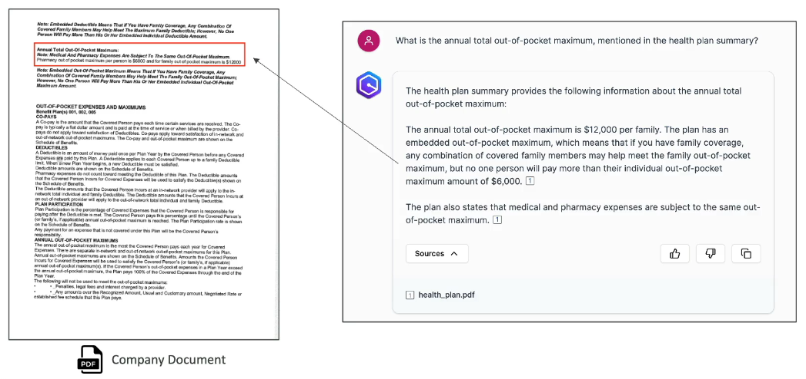
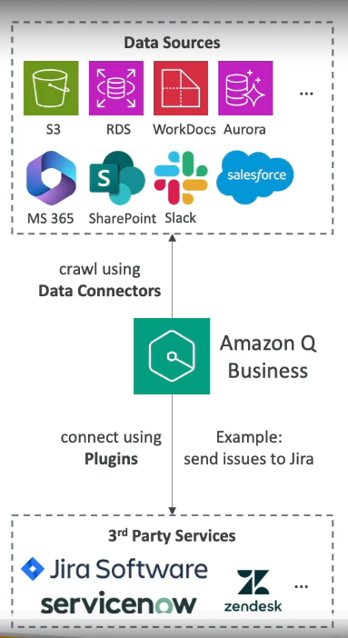
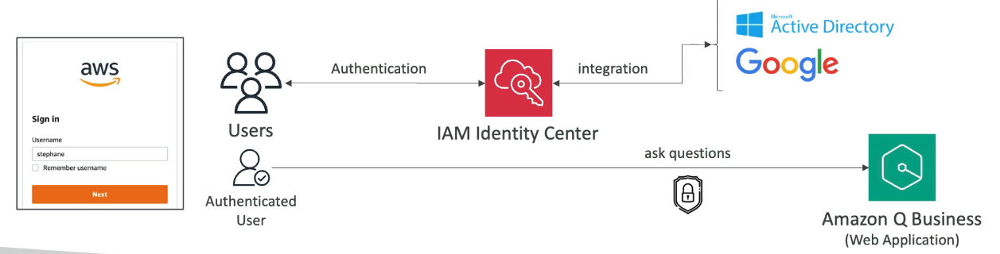
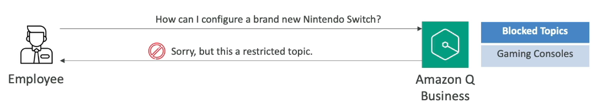

# Amazon Q

## Amazon Q Business
- Fully managed Gen AI assistant based on your company's knowledge and data.
- You can ask Amazon Q to:
  - Write a posting for a Senior Product Marketing Manager role.
  - Create a social media post under 50 words to advertise the new role.
  - Provide details of what was discussed during the team meeting of the week of August 1st.

## Technology
- Built on Amazon Bedrock.
- Multiple foundation models available.

## Example of Amazon Q

- Amazon Q can read internal PDF documents and locate the information, sourcing it as well.
- The source is clickable.

## DATA Connectors (Fully Managed RAG)
- Connects to various data sources such as:
  - Amazon S3
  - RDS
  - Aurora
  - WorkDocs
- Non-AWS sources include:
  - Microsoft 365
  - Salesforce
  - Google Drive
  - Gmail
  - Slack
  - SharePoint

## Plugins
- Allows Amazon Q to interact with third-party services such as:
  - Jira
  - ServiceNow
  - Zendesk
  - Salesforce

## User Authentication
- Users are authenticated via IAM Identity Center.
- Users will only have access to the documents they should have access to.
- Responses will come from documents that they have access to ONLY.
- Each authenticated user has its own set of permissions.
- Users can log into integrated systems such as Microsoft Active Directory and Google.

## Admin Controls
- Customize responses to your organizational needs.
- Admin controls = Guardrails.
- Block specific words or topics.

