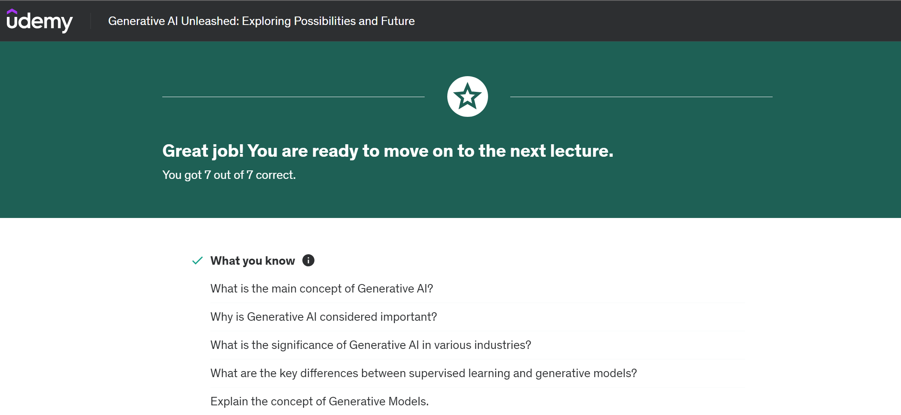
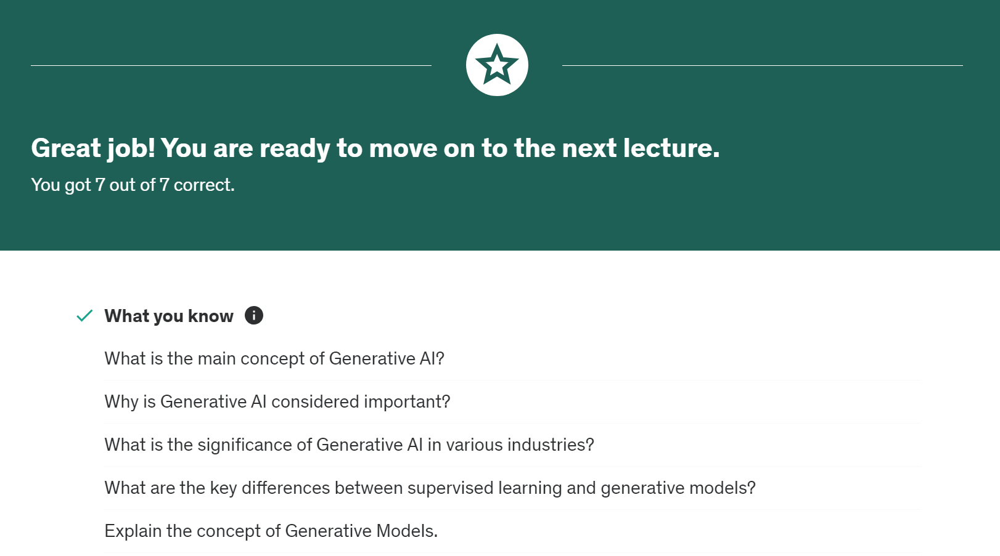
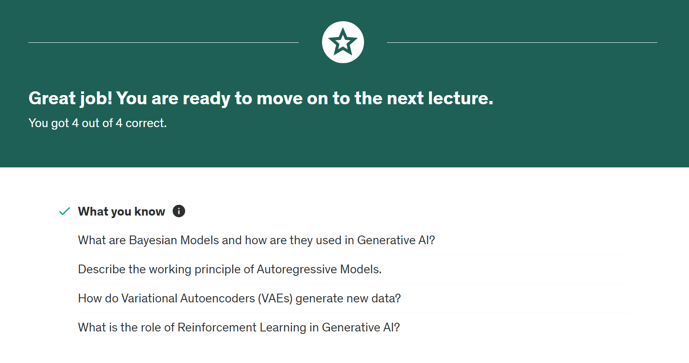
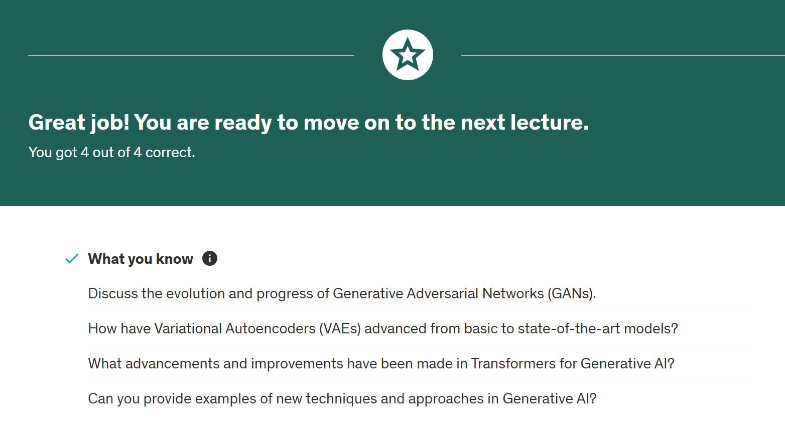
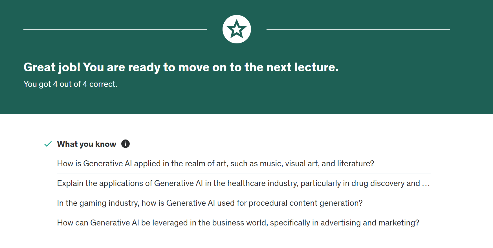
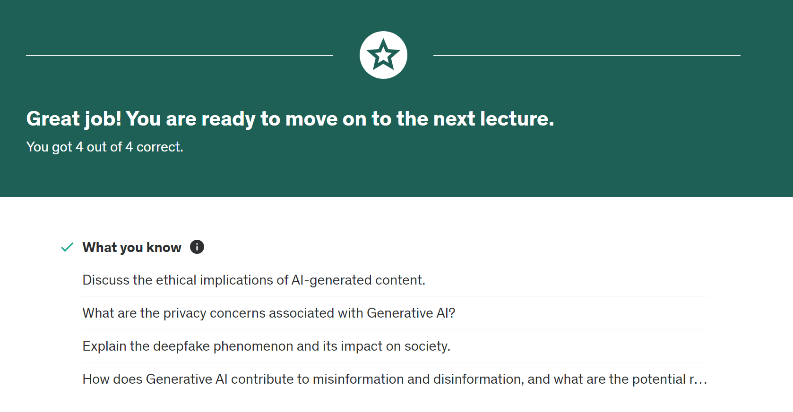
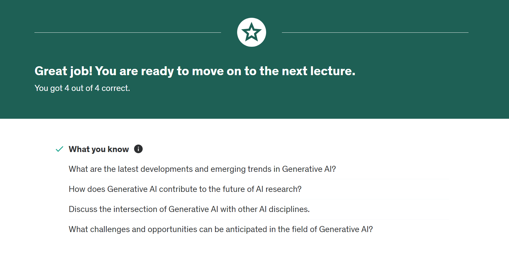
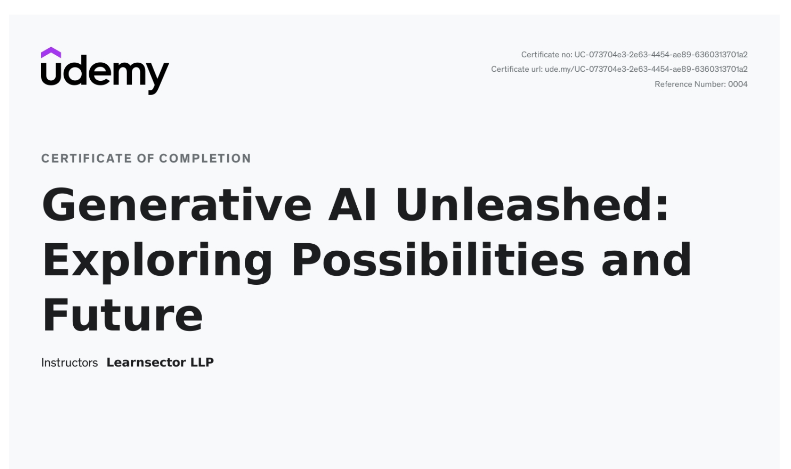

# Notes on Generative AI

## What is Generative AI?

**Generative AI** is a branch of artificial intelligence focused on creating new, synthetic data that mimics the patterns and features of real-world data. Unlike traditional AI systems that might classify or predict based on existing data, Generative AI models learn from a dataset to generate new, similar examples that could be indistinguishable from actual data.

## Generative AI Unleashed: Exploring Possibilities and Future

In the first part of the course, dive into the fundamental principles of Generative AI, including Bayesian models and autoregressive models. Discover the power of Variational Autoencoders (VAEs) and Generative Adversarial Networks (GANs) to generate realistic and imaginative content. Gain insights into the role of reinforcement learning and transformers in driving advancements in Generative AI.

## AI Subfields

- **Machine Learning**
- **Neural Networks**
- **Deep Learning**
- **Cognitive Computing**
- **Generative AI**

## Creating New Data Models from a Set of Training Data

Generative AI analyzes and learns from a set of training data using:

- **Neural Networks**
- **Machine Learning Algorithms**

Generative AI has the ability to create new content based on learned patterns.

## Generative Adversarial Networks (GANs)

GANs consist of two parts:

1. **Generator**
   - Gradually improves its output.
   - Creates increasingly realistic and complex data.

2. **Discriminator**
   - Evaluates the data produced by the generator.

The training process involves providing the model with large amounts of data. Generative models improve their ability to generate realistic content over time.

## Applications of Generative AI

- **Entertainment**: Creation of new music, scripts, and digital art.
- **Healthcare**: Generation of synthetic medical images for research.
- **Education**: Personalized learning experiences.
- **Art**: Digital painting, design, and building.

## Importance and Potential

- **Advertising**: A game-changer for personalized ad content, leading to more effective ad campaigns and higher engagement and conversion rates.
- **Manufacturing**: Predictive models for maintenance issues, leading to cost savings.
- **Entertainment**: Creation of unique content, personalized experiences, and enhanced engagement, including character design for games and music scripts.

## Future Directions

- **Rapid Advancements**: Leading to spectacular virtual realities.
- **New Possibilities**: 
  - Image-to-image conversion
  - Resolution enhancement
  - 3D shape generation
  - Speech-to-speech conversion
  - Code generation

## Ethical Considerations

- **Data Privacy**
- **Fairness**
- **Accountability**

## Historical Context

- **Early Beginnings**: Simple models for basic tasks evolved into more sophisticated systems.
- **GANs Introduction**: 2014, a significant step forward for realistic and complex data generation.
- **GPT-3 and GPT-4**: Create realistic text. 

### Timeline
- **1940-1950**: Early concepts of AI.
- **1860-1970**: Development of chatbots.
- **2000-2010**: Introduction of Siri.
- **2014**: Introduction of GANs.
- **2020-2023**: GPT-3, GPT-4, and DALL·E 2.

## Key Figures

- **Ian Goodfellow**
- **Yoshua Bengio**

## Fundamental Concepts of Generative AI

- **Machine Learning (ML)**
- **Neural Networks**
- **Deep Learning**
- **Generative Models**

# Notes on AI and Machine Learning

## Types of AI

**Artificial Intelligence (AI)** provides systems with the ability to learn without being explicitly programmed and to learn from experience. It involves:

- **Recognizing patterns in data**
- **Making decisions according to those patterns**

## Types of Machine Learning

1. **Supervised Learning**
   - The model is provided with labeled data.
   - The model learns to map inputs to outputs based on the labeled examples.

2. **Unsupervised Learning**
   - The model is provided with unlabeled data.
   - The model determines patterns and structures within the data.

3. **Reinforcement Learning**
   - The model learns to make decisions by performing actions and receiving rewards or penalties based on the outcomes.

## Machine Learning Workflow

- **Input Data** -> **Machine Learning Models** -> **Output**

## Deep Learning

**Deep Learning** is a subset of machine learning that uses neural networks with many layers (deep networks). These deep networks can learn from data in a more sophisticated way compared to other methods. The key components include:

- **Input Layer**
- **Hidden Layers**
- **Output Layer**

## Applications of Deep Learning

- **Image Recognition**
- **Natural Language Processing (NLP)**
- **Self-Driving Cars**

## Generative Models

Generative models aim to learn the true data distribution and can mimic the distribution of the training data. Notable types include:

- **Generative Adversarial Networks (GANs)**
  - Consist of a generator and a discriminator.
  - The generator creates data, and the discriminator evaluates its authenticity.

- **Variational Autoencoders (VAEs)**
  - A type of autoencoder that uses a probabilistic approach to generate new data samples.

## Challenges in Generative Models

- **Difficulty in controlling the output**
- **Risk of generating inappropriate content**

# Techniques Used in Generative AI

## Bayesian Models

**Bayesian Models** are statistical models based on Bayes' theorem, which deals with conditional probabilities. They update our beliefs with new data, allowing for learning from observed data. 

- **Bayesian Updating**: Uses a priori distribution (initial beliefs) and the likelihood function to compute the posterior distribution, refining predictions based on new information.
- **Applications**:
  - **Finance**: Predicting market trends and stock prices.
  - **Healthcare**: Predicting patient outcomes and treatment responses.

Bayesian models provide a full probability distribution, allowing us to understand the uncertainty of predictions. Tools like STAN/PyMC and TensorFlow can be used to implement these models.

## Auto-Regressive Models

**Auto-Regressive Models** predict future values based on past data, assuming that future values are a function of previous values. They are widely used in time series forecasting.

- **Concept**: These models establish a relationship between current values and previous values within a dataset, using coefficients to make predictions.
- **Applications**:
  - **Finance**: Forecasting stock prices.
  - **Meteorology**: Predicting weather patterns.

Auto-regressive models are useful for accurate predictions in various fields, such as stock prices and energy consumption.

## Variational Autoencoders (VAEs)

**Variational Autoencoders** combine deep learning with Bayesian principles to encode and decode data.

- **Functionality**: VAEs encode input data into a compact representation and generate new data by decoding this representation. The encoding captures variations in the data, allowing for new data generation.
- **Architecture**:
  - **Encoder**: Compresses input data into a latent representation.
  - **Decoder**: Reconstructs data from the latent representation.

- **Applications**:
  - **Image Generation**: Creating new images resembling training data.
  - **Synthetic Data**: Generating training data for machine learning models.
  - **Anomaly Detection**: Identifying unusual patterns in cybersecurity.

## Generative Adversarial Networks (GANs)

**Generative Adversarial Networks** are a popular technique that involves two neural networks: the generator and the discriminator.

- **Concept**: The generator creates new data, while the discriminator evaluates its authenticity. The two networks are trained simultaneously, with the generator improving over time based on feedback from the discriminator.
- **Applications**:
  - **Image Generation**: Creating realistic images, such as faces and landscapes.
  - **Simulated Data**: Generating data for various applications.

GANs are known for their ability to generate highly realistic and complex data.

## Transformers in Generative AI

**Transformers** have revolutionized natural language processing by using attention mechanisms to weigh the importance of different parts of the data.

- **Architecture**:
  - **Encoder-Decoder**: Processes and generates sequences of data.
  - **Attention Mechanism**: Captures dependencies and context within the data.

- **Applications**:
  - **Text Generation**: Producing coherent text for news articles and stories.
  - **Language Translation**: Translating text between languages while preserving context.

Transformers help in generating contextually relevant and coherent text.

## Role of Reinforcement Learning in Generative AI

**Reinforcement Learning** is a type of machine learning where an agent learns to make decisions by receiving rewards based on its actions. 

- **Concept**: The agent learns to choose the best actions to maximize rewards, which can guide data generation and improve models over time.
- **Applications**:
  - **Music Generation**: Creating music based on mood or style preferences.
  - **Improving Models**: Using feedback to enhance the quality of generated data.

Reinforcement learning helps in refining generative models by optimizing performance through feedback and rewards.

# Advanced Generative AI Techniques

## Progressive GANs

**Progressive GANs** (Generative Adversarial Networks) are a type of GAN that improves training stability and the quality of generated images by progressively growing both the generator and discriminator.

- **StyleGAN**: Developed by Nvidia, StyleGAN introduces a novel approach to GANs by using a style-based architecture. It allows for fine-grained control over the generated images.
- **StyleGAN2**: An improvement over StyleGAN, StyleGAN2 addresses artifacts in generated images and provides even higher quality outputs.
- **CycleGAN**: Focuses on unpaired image-to-image translation, allowing for transformations between domains without needing paired examples.
- **Pix2Pix**: A GAN-based approach for paired image-to-image translation tasks, such as converting sketches to photos.
- **BigGAN**: A GAN designed for generating high-resolution images by scaling up both the model and training data.

## Variational Autoencoders (VAEs)

**Variational Autoencoders** are a type of generative model that combines deep learning with Bayesian inference. They encode input data into a latent space and then decode it to generate new samples.

- **Kingma and Welling (2013)**: Introduced the original VAE framework, which laid the foundation for many of its variants.
- **Conditional VAEs (CVAEs)**: Extend VAEs to conditionally generate data based on additional inputs, such as labels or features.
- **Beta-VAEs**: A variant of VAEs that introduces a hyperparameter (β) to control the trade-off between the reconstruction loss and the KL divergence, leading to better disentangled representations.
- **VQ-VAE**: Uses vector quantization to encode data into discrete latent variables, enabling more powerful generative capabilities.
- **Flow-Based VAEs**: Integrate normalizing flows with VAEs to improve the flexibility of the latent space and enhance the quality of generated samples.

## Transformers

**Transformers** were originally introduced for natural language processing (NLP) tasks but have since been adapted for various other domains due to their versatility.

- **Transformer XL**: Enhances the original Transformer model by introducing recurrence and memory mechanisms to handle long-range dependencies in text.
- **Compressive Transformer**: Improves on Transformer XL by compressing long-term memory to manage longer sequences more efficiently.
- **GPT-3 and GPT-4**: Generative Pre-trained Transformers developed by OpenAI that achieve state-of-the-art performance in various language tasks, including text generation and comprehension.
- **T5 (Text-to-Text Transfer Transformer)**: A unified model that treats all NLP tasks as text-to-text problems, enabling a wide range of applications.
- **BART (Bidirectional and Auto-Regressive Transformers)**: Combines bidirectional encoding with auto-regressive decoding for improved text generation and comprehension.

## New Techniques and Approaches

### Wasserstein GANs

**Wasserstein GANs (WGANs)** improve the training stability of GANs by using the Wasserstein distance as a measure of divergence between distributions. This approach helps stabilize training and produce higher-quality generated samples.

### Combining VAEs and GANs

Integrating VAEs and GANs combines the strengths of both models. VAEs are used for learning a latent space representation, while GANs are employed to generate realistic samples from this representation.

### Integration of Learning Techniques

Combining various learning techniques, such as reinforcement learning with generative models, can lead to innovative approaches and applications. For example, integrating reinforcement learning with generative models can guide the generation process to produce more desirable outputs.

### Speech-to-Speech and Code Generation

- **Speech-to-Speech**: Recent advancements have made it possible to convert speech directly to speech in different languages or styles using generative models.
- **Code Generation**: Models like OpenAI’s Codex and GitHub Copilot use generative techniques to assist in writing and completing code snippets, demonstrating the application of generative models in software development.

These advancements and techniques continue to push the boundaries of what is possible with Generative AI, offering new possibilities and applications across various fields.

# New Techniques and Approaches in Generative AI

## Advanced Generative AI Techniques

### Wasserstein GANs (WGANs)

**Wasserstein GANs** address some of the limitations of traditional GANs by using the Wasserstein distance (also known as Earth Mover's Distance) to measure the difference between distributions. This approach helps stabilize the training process and produce higher-quality outputs.

- **Concept**: WGANs provide a more meaningful loss function that improves convergence and mitigates issues such as mode collapse.
- **Benefits**: Enhanced stability during training, better performance in generating realistic samples, and improved model robustness.

### Combining VAEs and GANs

Integrating **Variational Autoencoders (VAEs)** with **Generative Adversarial Networks (GANs)** combines the strengths of both models. VAEs learn a latent space representation of the data, while GANs are used to generate realistic samples from this representation.

- **Concept**: VAEs handle latent space learning and data encoding, while GANs refine the generation process to produce high-quality samples.
- **Applications**: Improved image synthesis, better data augmentation, and more flexible generative models.

### Integration of Learning Techniques

Combining different learning techniques, such as reinforcement learning with generative models, can lead to innovative applications and improvements.

- **Concept**: Reinforcement learning can guide the generative process by providing feedback on generated samples, optimizing performance based on rewards.
- **Applications**: Enhanced creative applications, adaptive content generation, and interactive systems.

### Speech-to-Speech Generation

**Speech-to-Speech** generation involves converting spoken language directly into speech in a different language or style. This approach uses generative models to perform translation or transformation of spoken content.

- **Concept**: Models are trained to map input speech to output speech, potentially incorporating style, tone, and language changes.
- **Applications**: Real-time language translation, accent conversion, and personalized voice assistants.

### Code Generation

**Code Generation** uses generative models to assist in writing and completing code snippets, making programming more efficient and accessible.

- **Concept**: Models like OpenAI's Codex leverage large datasets of code to understand context and generate relevant code snippets.
- **Applications**: Automated code completion, code translation between languages, and generating boilerplate code.

# Applications of Generative AI

## Art

**Generative AI** has transformative potential in the field of art.

- **Visual Artwork**: AI can generate artwork in various styles, mimic famous artists, and create novel visual compositions. This includes style transfer, where the model applies the style of one artwork to a new image.
- **Creative Collaboration**: Artists and AI can collaborate to explore new artistic styles and techniques, leading to innovative art forms.

## Healthcare

Generative AI is making significant strides in healthcare.

- **Synthetic Data**: Generating synthetic medical images and data for research, training, and improving diagnostic tools.
- **Drug Discovery**: AI can help in designing new molecules and predicting their properties, speeding up the drug discovery process.

## Gaming

In the gaming industry, generative AI is used to enhance creativity and design.

- **Content Generation**: AI generates game levels, characters, and environments, providing diverse and engaging experiences.
- **Personalization**: Tailoring in-game experiences based on player preferences and behavior.

## Business

Generative AI applications in business include:

- **Marketing**: AI-generated content for advertising, personalized marketing materials, and campaign optimization.
- **Product Design**: Creating new product concepts and prototypes using generative models.

## AI-Generated Music

Generative AI can also create music with various applications:

- **Imitating Styles**: Mimicking the style of different composers or genres to create new music.
- **Composing Original Music**: Generating unique compositions based on learned patterns from existing music.
- **Collaborative Creativity**: Collaborating with human musicians to enhance creativity and explore new musical ideas.

Generative AI is continuously evolving, offering new possibilities and applications across diverse domains. Its ability to create, simulate, and innovate opens up exciting opportunities for future developments.

# Ethical and Societal Considerations in Generative AI

## Ethical Implications

### Impact on Intellectual Property

Generative AI can create content similar to existing works, leading to potential legal and ethical issues regarding intellectual property.

- **Ownership Complexities**: Determining ownership of AI-generated content involves both human creators and AI systems, complicating intellectual property rights.
- **Legal Concerns**: Addressing these implications requires understanding local frameworks and intellectual property laws.

### Authenticity and Trustworthiness

AI-generated content raises concerns about authenticity and trustworthiness.

- **Manipulation and Deception**: Highly realistic AI-generated content can be used to manipulate and deceive, posing risks to public trust.
- **Verification**: Ensuring the authenticity of AI-generated content is crucial for combating misinformation. Implementing safeguards and verification mechanisms is essential for maintaining transparency and integrity.

## Privacy Concerns

### Data Privacy and Security

Generative AI relies on sensitive data, raising significant privacy concerns.

- **Collection and Usage**: The collection, storage, and usage of data must be handled with care to protect individuals' rights.
- **Data Security**: Robust data security measures and adherence to regulations are necessary to safeguard privacy.
- **Re-identification Risks**: The risk of re-identifying anonymized data poses challenges for privacy protection. Implementing privacy-preserving techniques is crucial to mitigating these risks.

### Balancing Data Utility and Privacy Protection

- **Complex Challenges**: Balancing the utility of data with privacy protection requires careful consideration and implementation of privacy-preserving techniques.
- **Mitigation Strategies**: Effective strategies must be developed to ensure data is used responsibly while protecting individual privacy.

## Deepfake Phenomenon

### Emergence and Risks

Deepfakes utilize generative AI to manipulate audio and video content, raising significant ethical and societal concerns.

- **Malicious Uses**: Deepfakes have the potential to be used for malicious purposes, such as spreading false information or manipulating public opinion.
- **Characteristics**: Understanding the characteristics of deepfakes is essential to addressing the ethical challenges they present.
- **Legal Frameworks**: Developing legal frameworks is necessary to deter malicious activities and promote awareness and literacy regarding deepfakes.

## Generative AI and Misinformation

### Challenges

Generative AI can produce text, images, and videos that fabricate false narratives, posing challenges for fact-checking and information accuracy.

- **Ethical Implications**: Addressing the ethical implications of AI-generated misinformation requires collaboration among stakeholders.
- **Building Trust**: Establishing trust in media sources and developing robust solutions for misinformation are critical.

## Ensuring Ethical and Responsible Use of AI

### Clear Ethical Frameworks

- **Importance**: Developing clear ethical frameworks is crucial for the responsible deployment of AI technologies.
- **Areas of Focus**: Key areas include data privacy, intellectual property rights, fairness, and accountability.
- **Guidance**: Providing guidance on responsible

# Future Trends in Generative AI

## Latest Developments and Emerging Trends

### Rapid Evolution of Generative AI

- **Enhanced Generative Samples**: Generative AI is rapidly evolving to produce more realistic and high-fidelity outputs.
- **Incorporation of Self-Supervised and Unsupervised Techniques**: These techniques are driving the field towards more robust and sophisticated models.

### Attention to Ethical and Responsible AI

- **Focus on Fairness and Bias**: There is an increasing emphasis on addressing fairness and bias in generative AI research.
- **Ethical Considerations**: As generative AI technology advances, ethical considerations are becoming central to its development and application.

## Role of Generative AI in the Future of AI Research

### Applications

- **Synthetic Data Generation**: Generative AI is used to generate synthetic data, overcoming limitations in data availability and quality.
- **Data Augmentation**: It helps augment existing datasets and introduce new variations, thereby improving model performance.

### Pre-Training Methods

- **Learning from Unlabeled and Labeled Data**: Generative models can learn from both unlabeled and labeled data, serving as powerful pre-training methods for various applications.

## Intersection of Generative AI and Other Disciplines

### Promise of Integration

- **Complex Behaviors and Decision-Making**: Generative AI shows promise in learning complex behaviors and decision-making processes.
- **Diverse and Realistic Training Scenarios**: These models can create diverse and realistic training scenarios for AI agents, enhancing their capabilities.

### Generative AI and Natural Language Processing

- **Language Generation Tasks**: Generative AI excels in tasks such as text completion, machine translation, and dialogue systems.
- **Improving Language Understanding**: It plays a crucial role in advancing language understanding and generation capabilities.

## Anticipated Challenges in Generative AI

### Addressing Challenges

- **Robustness**: Ensuring the robustness of generative models remains a key challenge. The field must continue to address issues related to the stability and reliability of these models.

### Future Considerations

- **Scalability**: As models become more complex, ensuring their scalability and efficiency will be essential.
- **Ethical Implications**: Ongoing attention to ethical implications and responsible AI use will be necessary to guide the future development of generative technologies.

Generative AI is poised to make significant strides, driven by advancements in technology and integration with other AI disciplines. Addressing ethical and practical challenges will be crucial for its continued progress and application.

